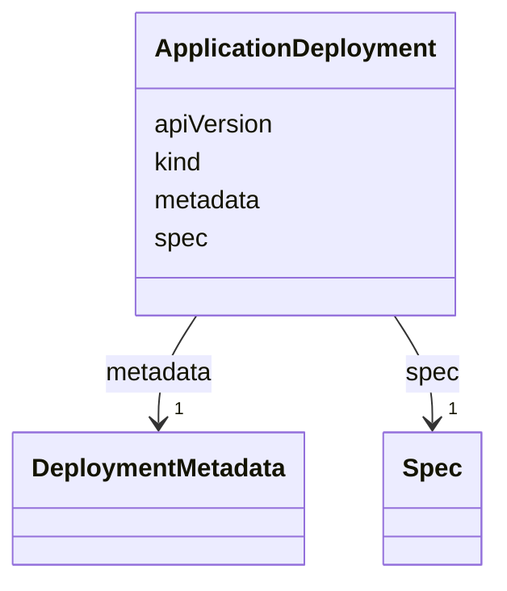

# Class: ApplicationDeployment 


_A class representing the desired state of an entity._


<!--
URI: [https://specification.margo.org/data-model/ApplicationDeployment](https://specification.margo.org/data-model/ApplicationDeployment)
-->





<!-- no inheritance hierarchy -->

## Attributes

| Name | Cardinality and Range | Description | Inheritance |
| ---  | --- | --- | --- |
| [apiVersion](apiVersion.md) | 1 <br/> [string](string.md) | Identifier of the version of the API the object definition follows | direct |
| [kind](kind.md) | 1 <br/> [string](string.md) | Must be `ApplicationDeployment` | direct |
| [metadata](metadata.md) | 1 <br/> [DeploymentMetadata](DeploymentMetadata.md) | Metadata element specifying characteristics about the application deployment | direct |
| [spec](spec.md) | 1 <br/> [Spec](Spec.md) | Spec element that defines deployment profile and parameters associated with t... | direct |


## In Subsets


* [api_resources](api_resources.md)


<!--
## Identifier and Mapping Information


### Schema Source


* from schema: https://specification.margo.org/data-model


## Mappings

| Mapping Type | Mapped Value |
| ---  | ---  |
| self | https://specification.margo.org/data-model/ApplicationDeployment |
| native | https://specification.margo.org/data-model/ApplicationDeployment |


-->


??? note "Only relevant for contributors of the specification"

    ## LinkML Source

    <!-- TODO: investigate https://stackoverflow.com/questions/37606292/how-to-create-tabbed-code-blocks-in-mkdocs-or-sphinx -->

    ### Direct

    ??? note "Details"
        ```yaml
        name: ApplicationDeployment
        description: A class representing the desired state of an entity.
        in_subset:
        - api_resources
        from_schema: https://specification.margo.org/data-model
        attributes:
          apiVersion:
            name: apiVersion
            description: Identifier of the version of the API the object definition follows.
            from_schema: https://specification.margo.org/application_deployment_schema
            rank: 1000
            domain_of:
            - ApplicationDeployment
            - ApplicationDescription
            - DeviceCapabilitiesManifest
            - DeploymentStatusManifest
            range: string
            required: true
          kind:
            name: kind
            description: Must be `ApplicationDeployment`.
            from_schema: https://specification.margo.org/application_deployment_schema
            rank: 1000
            designates_type: true
            domain_of:
            - ApplicationDeployment
            - ApplicationDescription
            - DeviceCapabilitiesManifest
            - DeploymentStatusManifest
            range: string
            required: true
            equals_string: ApplicationDeployment
          metadata:
            name: metadata
            description: Metadata element specifying characteristics about the application
              deployment. See the [Metadata Attributes](#metadata-attributes) section below.
            from_schema: https://specification.margo.org/application_deployment_schema
            rank: 1000
            domain_of:
            - ApplicationDeployment
            - ApplicationDescription
            range: DeploymentMetadata
            required: true
          spec:
            name: spec
            description: Spec element that defines deployment profile and parameters associated
              with the application deployment. See the [Spec Attributes](#spec-attributes)
              section below.
            from_schema: https://specification.margo.org/application_deployment_schema
            rank: 1000
            domain_of:
            - ApplicationDeployment
            range: Spec
            required: true

        ```

    ### Induced

    ??? note "Details"
        ```yaml
        name: ApplicationDeployment
        description: A class representing the desired state of an entity.
        in_subset:
        - api_resources
        from_schema: https://specification.margo.org/data-model
        attributes:
          apiVersion:
            name: apiVersion
            description: Identifier of the version of the API the object definition follows.
            from_schema: https://specification.margo.org/application_deployment_schema
            rank: 1000
            alias: apiVersion
            owner: ApplicationDeployment
            domain_of:
            - ApplicationDeployment
            - ApplicationDescription
            - DeviceCapabilitiesManifest
            - DeploymentStatusManifest
            range: string
            required: true
          kind:
            name: kind
            description: Must be `ApplicationDeployment`.
            from_schema: https://specification.margo.org/application_deployment_schema
            rank: 1000
            designates_type: true
            alias: kind
            owner: ApplicationDeployment
            domain_of:
            - ApplicationDeployment
            - ApplicationDescription
            - DeviceCapabilitiesManifest
            - DeploymentStatusManifest
            range: string
            required: true
            equals_string: ApplicationDeployment
          metadata:
            name: metadata
            description: Metadata element specifying characteristics about the application
              deployment. See the [Metadata Attributes](#metadata-attributes) section below.
            from_schema: https://specification.margo.org/application_deployment_schema
            rank: 1000
            alias: metadata
            owner: ApplicationDeployment
            domain_of:
            - ApplicationDeployment
            - ApplicationDescription
            range: DeploymentMetadata
            required: true
          spec:
            name: spec
            description: Spec element that defines deployment profile and parameters associated
              with the application deployment. See the [Spec Attributes](#spec-attributes)
              section below.
            from_schema: https://specification.margo.org/application_deployment_schema
            rank: 1000
            alias: spec
            owner: ApplicationDeployment
            domain_of:
            - ApplicationDeployment
            range: Spec
            required: true

        ```