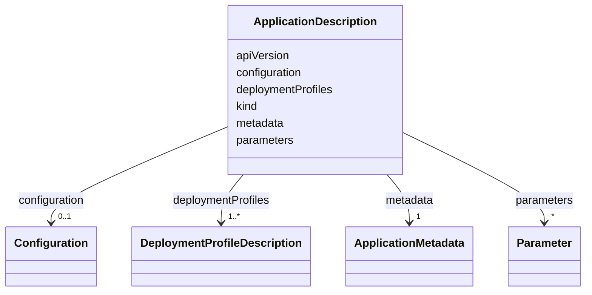

# Class: ApplicationDescription 


_Root class for an application description._


<!--
URI: [https://specification.margo.org/data-model/ApplicationDescription](https://specification.margo.org/data-model/ApplicationDescription)
-->





<!-- no inheritance hierarchy -->

## Attributes

| Name | Cardinality and Range | Description | Inheritance |
| ---  | --- | --- | --- |
| [apiVersion](apiVersion.md) | 1 <br/> [string](string.md) | Identifier of the version of the API the object definition follows | direct |
| [kind](kind.md) | 1 <br/> [string](string.md) | Specifies the object type; must be `ApplicationDescription` | direct |
| [metadata](metadata.md) | 1 <br/> [ApplicationMetadata](ApplicationMetadata.md) | Metadata element specifying characteristics about the application deployment | direct |
| [deploymentProfiles](deploymentProfiles.md) | 1..* <br/> [DeploymentProfileDescription](DeploymentProfileDescription.md) | Deployment profiles element specifying the types of deployments the applicati... | direct |
| [parameters](parameters.md) | * <br/> [Parameter](Parameter.md) | Parameters element specifying the configurable parameters to use when install... | direct |
| [configuration](configuration.md) | 0..1 <br/> [Configuration](Configuration.md) | Configuration element specifying how parameters should be displayed to the us... | direct |


<!--
## Identifier and Mapping Information


### Schema Source


* from schema: https://specification.margo.org/data-model


## Mappings

| Mapping Type | Mapped Value |
| ---  | ---  |
| self | https://specification.margo.org/data-model/ApplicationDescription |
| native | https://specification.margo.org/data-model/ApplicationDescription |


-->


??? note "Only relevant for contributors of the specification"

    ## LinkML Source

    <!-- TODO: investigate https://stackoverflow.com/questions/37606292/how-to-create-tabbed-code-blocks-in-mkdocs-or-sphinx -->

    ### Direct

    ??? note "Details"
        ```yaml
        name: ApplicationDescription
        description: Root class for an application description.
        from_schema: https://specification.margo.org/data-model
        attributes:
          apiVersion:
            name: apiVersion
            description: Identifier of the version of the API the object definition follows.
            from_schema: https://specification.margo.org/application-schema
            domain_of:
            - ApplicationDeployment
            - ApplicationDescription
            - DeviceCapabilitiesManifest
            - DeploymentStatusManifest
            range: string
            required: true
          kind:
            name: kind
            description: Specifies the object type; must be `ApplicationDescription`.
            from_schema: https://specification.margo.org/application-schema
            designates_type: true
            domain_of:
            - ApplicationDeployment
            - ApplicationDescription
            - DeviceCapabilitiesManifest
            - DeploymentStatusManifest
            range: string
            required: true
            equals_string: ApplicationDescription
          metadata:
            name: metadata
            description: Metadata element specifying characteristics about the application
              deployment. See the [Metadata Attributes](#metadata-attributes) section below.
            from_schema: https://specification.margo.org/application-schema
            domain_of:
            - ApplicationDeployment
            - ApplicationDescription
            range: ApplicationMetadata
            required: true
          deploymentProfiles:
            name: deploymentProfiles
            description: Deployment profiles element specifying the types of deployments the
              application supports. See the [Deployment](#deploymentprofile-attributes) section
              below.
            from_schema: https://specification.margo.org/application-schema
            rank: 1000
            domain_of:
            - ApplicationDescription
            range: DeploymentProfileDescription
            required: true
            multivalued: true
            inlined: true
            inlined_as_list: true
          parameters:
            name: parameters
            description: Parameters element specifying the configurable parameters to use
              when installing, or updating, the application. See the [Parameter](#parameter-attributes)
              section below.
            from_schema: https://specification.margo.org/application-schema
            domain_of:
            - Spec
            - ApplicationDescription
            range: Parameter
            multivalued: true
            inlined: true
            inlined_as_list: false
          configuration:
            name: configuration
            description: Configuration element specifying how parameters should be displayed
              to the user for setting the value as well as the rules to use to validate the
              user's input. See the [Configuration](#configuration-attributes) section below.
            from_schema: https://specification.margo.org/application-schema
            rank: 1000
            domain_of:
            - ApplicationDescription
            range: Configuration

        ```

    ### Induced

    ??? note "Details"
        ```yaml
        name: ApplicationDescription
        description: Root class for an application description.
        from_schema: https://specification.margo.org/data-model
        attributes:
          apiVersion:
            name: apiVersion
            description: Identifier of the version of the API the object definition follows.
            from_schema: https://specification.margo.org/application-schema
            alias: apiVersion
            owner: ApplicationDescription
            domain_of:
            - ApplicationDeployment
            - ApplicationDescription
            - DeviceCapabilitiesManifest
            - DeploymentStatusManifest
            range: string
            required: true
          kind:
            name: kind
            description: Specifies the object type; must be `ApplicationDescription`.
            from_schema: https://specification.margo.org/application-schema
            designates_type: true
            alias: kind
            owner: ApplicationDescription
            domain_of:
            - ApplicationDeployment
            - ApplicationDescription
            - DeviceCapabilitiesManifest
            - DeploymentStatusManifest
            range: string
            required: true
            equals_string: ApplicationDescription
          metadata:
            name: metadata
            description: Metadata element specifying characteristics about the application
              deployment. See the [Metadata Attributes](#metadata-attributes) section below.
            from_schema: https://specification.margo.org/application-schema
            alias: metadata
            owner: ApplicationDescription
            domain_of:
            - ApplicationDeployment
            - ApplicationDescription
            range: ApplicationMetadata
            required: true
          deploymentProfiles:
            name: deploymentProfiles
            description: Deployment profiles element specifying the types of deployments the
              application supports. See the [Deployment](#deploymentprofile-attributes) section
              below.
            from_schema: https://specification.margo.org/application-schema
            rank: 1000
            alias: deploymentProfiles
            owner: ApplicationDescription
            domain_of:
            - ApplicationDescription
            range: DeploymentProfileDescription
            required: true
            multivalued: true
            inlined: true
            inlined_as_list: true
          parameters:
            name: parameters
            description: Parameters element specifying the configurable parameters to use
              when installing, or updating, the application. See the [Parameter](#parameter-attributes)
              section below.
            from_schema: https://specification.margo.org/application-schema
            alias: parameters
            owner: ApplicationDescription
            domain_of:
            - Spec
            - ApplicationDescription
            range: Parameter
            multivalued: true
            inlined: true
            inlined_as_list: false
          configuration:
            name: configuration
            description: Configuration element specifying how parameters should be displayed
              to the user for setting the value as well as the rules to use to validate the
              user's input. See the [Configuration](#configuration-attributes) section below.
            from_schema: https://specification.margo.org/application-schema
            rank: 1000
            alias: configuration
            owner: ApplicationDescription
            domain_of:
            - ApplicationDescription
            range: Configuration

        ```