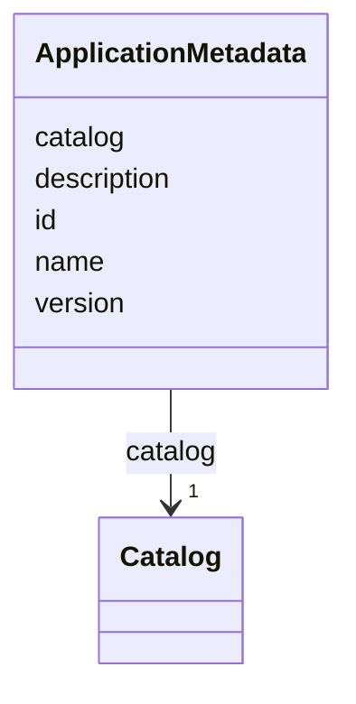

# Class: ApplicationMetadata 


_Metadata about the application._


<!--
URI: [https://specification.margo.org/data-model/ApplicationMetadata](https://specification.margo.org/data-model/ApplicationMetadata)
-->





<!-- no inheritance hierarchy -->

## Attributes

| Name | Cardinality and Range | Description | Inheritance |
| ---  | --- | --- | --- |
| [id](id.md) | 1 <br/> [string](string.md) | An identifier for the application | direct |
| [name](name.md) | 1 <br/> [string](string.md) | The application's official name | direct |
| [description](description.md) | 0..1 <br/> [string](string.md) |  | direct |
| [version](version.md) | 1 <br/> [string](string.md) | The application's version | direct |
| [catalog](catalog.md) | 1 <br/> [Catalog](Catalog.md) | Catalog element specifying the application's metadata for enabling its discov... | direct |


## Usages

| used by | used in | type | used |
| ---  | --- | --- | --- |
| [ApplicationDescription](ApplicationDescription.md) | [metadata](metadata.md) | range | [ApplicationMetadata](ApplicationMetadata.md) |


<!--
## Identifier and Mapping Information


### Schema Source


* from schema: https://specification.margo.org/data-model


## Mappings

| Mapping Type | Mapped Value |
| ---  | ---  |
| self | https://specification.margo.org/data-model/ApplicationMetadata |
| native | https://specification.margo.org/data-model/ApplicationMetadata |


-->


??? note "Only relevant for contributors of the specification"

    ## LinkML Source

    <!-- TODO: investigate https://stackoverflow.com/questions/37606292/how-to-create-tabbed-code-blocks-in-mkdocs-or-sphinx -->

    ### Direct

    ??? note "Details"
        ```yaml
        name: ApplicationMetadata
        description: Metadata about the application.
        from_schema: https://specification.margo.org/data-model
        attributes:
          id:
            name: id
            description: An identifier for the application. The id is used to help create
              unique identifiers where required, such as namespaces. The id must be lower
              case letters and numbers and MAY contain dashes. Uppercase letters, underscores
              and periods MUST NOT be used. The id MUST NOT be more than 200 characters.
            from_schema: https://specification.margo.org/application-schema
            domain_of:
            - DeploymentAnnotations
            - ApplicationMetadata
            - DeploymentProfileDescription
            - Properties
            range: string
            required: true
            pattern: ^[a-z0-9-]{1,200}$
          name:
            name: name
            description: The application's official name. This name is for display purposes
              only and can container whitespace and special characters.
            from_schema: https://specification.margo.org/application-schema
            domain_of:
            - Component
            - Parameter
            - DeploymentMetadata
            - ApplicationMetadata
            - Author
            - Organization
            - Section
            - Setting
            - Schema
            - ComponentStatus
            range: string
            required: true
          description:
            name: description
            from_schema: https://specification.margo.org/application-schema
            rank: 1000
            domain_of:
            - ApplicationMetadata
            - DeploymentProfileDescription
            - Setting
            range: string
          version:
            name: version
            description: The application's version.
            from_schema: https://specification.margo.org/application-schema
            rank: 1000
            domain_of:
            - ApplicationMetadata
            range: string
            required: true
          catalog:
            name: catalog
            description: Catalog element specifying the application's metadata for enabling
              its discovery. See the [Catalog](#catalog-attributes) section below.
            from_schema: https://specification.margo.org/application-schema
            rank: 1000
            domain_of:
            - ApplicationMetadata
            range: Catalog
            required: true

        ```

    ### Induced

    ??? note "Details"
        ```yaml
        name: ApplicationMetadata
        description: Metadata about the application.
        from_schema: https://specification.margo.org/data-model
        attributes:
          id:
            name: id
            description: An identifier for the application. The id is used to help create
              unique identifiers where required, such as namespaces. The id must be lower
              case letters and numbers and MAY contain dashes. Uppercase letters, underscores
              and periods MUST NOT be used. The id MUST NOT be more than 200 characters.
            from_schema: https://specification.margo.org/application-schema
            alias: id
            owner: ApplicationMetadata
            domain_of:
            - DeploymentAnnotations
            - ApplicationMetadata
            - DeploymentProfileDescription
            - Properties
            range: string
            required: true
            pattern: ^[a-z0-9-]{1,200}$
          name:
            name: name
            description: The application's official name. This name is for display purposes
              only and can container whitespace and special characters.
            from_schema: https://specification.margo.org/application-schema
            alias: name
            owner: ApplicationMetadata
            domain_of:
            - Component
            - Parameter
            - DeploymentMetadata
            - ApplicationMetadata
            - Author
            - Organization
            - Section
            - Setting
            - Schema
            - ComponentStatus
            range: string
            required: true
          description:
            name: description
            from_schema: https://specification.margo.org/application-schema
            rank: 1000
            alias: description
            owner: ApplicationMetadata
            domain_of:
            - ApplicationMetadata
            - DeploymentProfileDescription
            - Setting
            range: string
          version:
            name: version
            description: The application's version.
            from_schema: https://specification.margo.org/application-schema
            rank: 1000
            alias: version
            owner: ApplicationMetadata
            domain_of:
            - ApplicationMetadata
            range: string
            required: true
          catalog:
            name: catalog
            description: Catalog element specifying the application's metadata for enabling
              its discovery. See the [Catalog](#catalog-attributes) section below.
            from_schema: https://specification.margo.org/application-schema
            rank: 1000
            alias: catalog
            owner: ApplicationMetadata
            domain_of:
            - ApplicationMetadata
            range: Catalog
            required: true

        ```