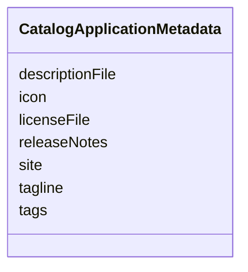

# Class: CatalogApplicationMetadata 


_Metadata specific to the application._


<!--
URI: [https://specification.margo.org/data-model/CatalogApplicationMetadata](https://specification.margo.org/data-model/CatalogApplicationMetadata)
-->





<!-- no inheritance hierarchy -->

## Attributes

| Name | Cardinality and Range | Description | Inheritance |
| ---  | --- | --- | --- |
| [descriptionFile](descriptionFile.md) | 0..1 <br/> [string](string.md) | Link to the file containing the application's full description | direct |
| [icon](icon.md) | 0..1 <br/> [string](string.md) | Link to the icon file (e | direct |
| [licenseFile](licenseFile.md) | 0..1 <br/> [string](string.md) | Link to the file that details the application's license | direct |
| [releaseNotes](releaseNotes.md) | 0..1 <br/> [string](string.md) | Statement about the changes for this application's release | direct |
| [site](site.md) | 0..1 <br/> [string](string.md) | Link to the application's website | direct |
| [tagline](tagline.md) | 0..1 <br/> [string](string.md) | The application's slogan | direct |
| [tags](tags.md) | * <br/> [string](string.md) | An array of strings that can be used to provide additional context for the ap... | direct |


## Usages

| used by | used in | type | used |
| ---  | --- | --- | --- |
| [Catalog](Catalog.md) | [application](application.md) | range | [CatalogApplicationMetadata](CatalogApplicationMetadata.md) |


<!--
## Identifier and Mapping Information


### Schema Source


* from schema: https://specification.margo.org/data-model


## Mappings

| Mapping Type | Mapped Value |
| ---  | ---  |
| self | https://specification.margo.org/data-model/CatalogApplicationMetadata |
| native | https://specification.margo.org/data-model/CatalogApplicationMetadata |


-->


??? note "Only relevant for contributors of the specification"

    ## LinkML Source

    <!-- TODO: investigate https://stackoverflow.com/questions/37606292/how-to-create-tabbed-code-blocks-in-mkdocs-or-sphinx -->

    ### Direct

    ??? note "Details"
        ```yaml
        name: CatalogApplicationMetadata
        description: Metadata specific to the application.
        from_schema: https://specification.margo.org/data-model
        attributes:
          descriptionFile:
            name: descriptionFile
            description: Link to the file containing the application's full description. The
              file should be a markdown file.
            from_schema: https://specification.margo.org/application-schema
            rank: 1000
            domain_of:
            - CatalogApplicationMetadata
            range: string
          icon:
            name: icon
            description: Link to the icon file (e.g., in PNG format).
            from_schema: https://specification.margo.org/application-schema
            rank: 1000
            domain_of:
            - CatalogApplicationMetadata
            range: string
          licenseFile:
            name: licenseFile
            description: Link to the file that details the application's license. The file
              should either be a plain text, markdown or PDF file.
            from_schema: https://specification.margo.org/application-schema
            rank: 1000
            domain_of:
            - CatalogApplicationMetadata
            range: string
          releaseNotes:
            name: releaseNotes
            description: Statement about the changes for this application's release. The file
              should either be a markdown or PDF file.
            from_schema: https://specification.margo.org/application-schema
            rank: 1000
            domain_of:
            - CatalogApplicationMetadata
            range: string
          site:
            name: site
            description: Link to the application's website.
            from_schema: https://specification.margo.org/application-schema
            rank: 1000
            domain_of:
            - CatalogApplicationMetadata
            - Organization
            range: string
          tagline:
            name: tagline
            description: The application's slogan.
            from_schema: https://specification.margo.org/application-schema
            rank: 1000
            domain_of:
            - CatalogApplicationMetadata
            range: string
          tags:
            name: tags
            description: An array of strings that can be used to provide additional context
              for the application in a user interface to assist with task such as categorizing,
              searching, etc.
            from_schema: https://specification.margo.org/application-schema
            rank: 1000
            domain_of:
            - CatalogApplicationMetadata
            range: string
            multivalued: true
            inlined: true
            inlined_as_list: true

        ```

    ### Induced

    ??? note "Details"
        ```yaml
        name: CatalogApplicationMetadata
        description: Metadata specific to the application.
        from_schema: https://specification.margo.org/data-model
        attributes:
          descriptionFile:
            name: descriptionFile
            description: Link to the file containing the application's full description. The
              file should be a markdown file.
            from_schema: https://specification.margo.org/application-schema
            rank: 1000
            alias: descriptionFile
            owner: CatalogApplicationMetadata
            domain_of:
            - CatalogApplicationMetadata
            range: string
          icon:
            name: icon
            description: Link to the icon file (e.g., in PNG format).
            from_schema: https://specification.margo.org/application-schema
            rank: 1000
            alias: icon
            owner: CatalogApplicationMetadata
            domain_of:
            - CatalogApplicationMetadata
            range: string
          licenseFile:
            name: licenseFile
            description: Link to the file that details the application's license. The file
              should either be a plain text, markdown or PDF file.
            from_schema: https://specification.margo.org/application-schema
            rank: 1000
            alias: licenseFile
            owner: CatalogApplicationMetadata
            domain_of:
            - CatalogApplicationMetadata
            range: string
          releaseNotes:
            name: releaseNotes
            description: Statement about the changes for this application's release. The file
              should either be a markdown or PDF file.
            from_schema: https://specification.margo.org/application-schema
            rank: 1000
            alias: releaseNotes
            owner: CatalogApplicationMetadata
            domain_of:
            - CatalogApplicationMetadata
            range: string
          site:
            name: site
            description: Link to the application's website.
            from_schema: https://specification.margo.org/application-schema
            rank: 1000
            alias: site
            owner: CatalogApplicationMetadata
            domain_of:
            - CatalogApplicationMetadata
            - Organization
            range: string
          tagline:
            name: tagline
            description: The application's slogan.
            from_schema: https://specification.margo.org/application-schema
            rank: 1000
            alias: tagline
            owner: CatalogApplicationMetadata
            domain_of:
            - CatalogApplicationMetadata
            range: string
          tags:
            name: tags
            description: An array of strings that can be used to provide additional context
              for the application in a user interface to assist with task such as categorizing,
              searching, etc.
            from_schema: https://specification.margo.org/application-schema
            rank: 1000
            alias: tags
            owner: CatalogApplicationMetadata
            domain_of:
            - CatalogApplicationMetadata
            range: string
            multivalued: true
            inlined: true
            inlined_as_list: true

        ```