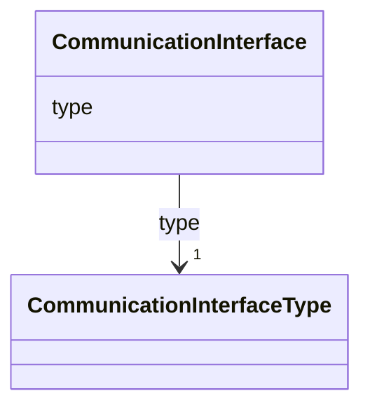

# Class: CommunicationInterface 


_Communication interface of a device._


<!--
URI: [https://specification.margo.org/data-model/CommunicationInterface](https://specification.margo.org/data-model/CommunicationInterface)
-->





<!-- no inheritance hierarchy -->

## Attributes

| Name | Cardinality and Range | Description | Inheritance |
| ---  | --- | --- | --- |
| [type](type.md) | 1 <br/> [CommunicationInterfaceType](CommunicationInterfaceType.md) | The type of a communication interface | direct |


## Usages

| used by | used in | type | used |
| ---  | --- | --- | --- |
| [Resources](Resources.md) | [interfaces](interfaces.md) | range | [CommunicationInterface](CommunicationInterface.md) |


<!--
## Identifier and Mapping Information


### Schema Source


* from schema: https://specification.margo.org/data-model


## Mappings

| Mapping Type | Mapped Value |
| ---  | ---  |
| self | https://specification.margo.org/data-model/CommunicationInterface |
| native | https://specification.margo.org/data-model/CommunicationInterface |


-->


??? note "Only relevant for contributors of the specification"

    ## LinkML Source

    <!-- TODO: investigate https://stackoverflow.com/questions/37606292/how-to-create-tabbed-code-blocks-in-mkdocs-or-sphinx -->

    ### Direct

    ??? note "Details"
        ```yaml
        name: CommunicationInterface
        description: Communication interface of a device.
        from_schema: https://specification.margo.org/data-model
        attributes:
          type:
            name: type
            description: The type of a communication interface. This can be e.g. Ethernet,
              WiFi, Cellular, Bluetooth, USB, CANBus, RS232. See the [CommunicationInterfaceType](#communicationinterfacetype)
              definition for all permissible values.
            from_schema: https://specification.margo.org/device-resources
            rank: 30
            domain_of:
            - DeploymentProfile
            - Peripheral
            - CommunicationInterface
            range: CommunicationInterfaceType
            required: true

        ```

    ### Induced

    ??? note "Details"
        ```yaml
        name: CommunicationInterface
        description: Communication interface of a device.
        from_schema: https://specification.margo.org/data-model
        attributes:
          type:
            name: type
            description: The type of a communication interface. This can be e.g. Ethernet,
              WiFi, Cellular, Bluetooth, USB, CANBus, RS232. See the [CommunicationInterfaceType](#communicationinterfacetype)
              definition for all permissible values.
            from_schema: https://specification.margo.org/device-resources
            rank: 30
            alias: type
            owner: CommunicationInterface
            domain_of:
            - DeploymentProfile
            - Peripheral
            - CommunicationInterface
            range: CommunicationInterfaceType
            required: true

        ```