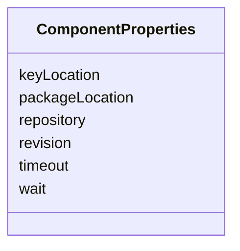

# Class: ComponentProperties 


_Properties dictionary for component deployment details._


<!--
URI: [https://specification.margo.org/data-model/ComponentProperties](https://specification.margo.org/data-model/ComponentProperties)
-->





<!-- no inheritance hierarchy -->

## Attributes

| Name | Cardinality and Range | Description | Inheritance |
| ---  | --- | --- | --- |
| [repository](repository.md) | 0..1 <br/> [string](string.md) | Repository location for the component | direct |
| [revision](revision.md) | 0..1 <br/> [string](string.md) | Revision version for the component | direct |
| [wait](wait.md) | 0..1 <br/> [boolean](boolean.md) | If True, indicates the device waits for the component installation to complet... | direct |
| [timeout](timeout.md) | 0..1 <br/> [string](string.md) | Time to wait for component installation to complete, formatted as "##m##s" | direct |
| [packageLocation](packageLocation.md) | 0..1 <br/> [string](string.md) | URL indicating the Compose package's location | direct |
| [keyLocation](keyLocation.md) | 0..1 <br/> [string](string.md) | URL for the public key used to validate a digitally signed package | direct |


## Usages

| used by | used in | type | used |
| ---  | --- | --- | --- |
| [Component](Component.md) | [properties](properties.md) | range | [ComponentProperties](ComponentProperties.md) |
| [HelmComponent](HelmComponent.md) | [properties](properties.md) | range | [ComponentProperties](ComponentProperties.md) |
| [ComposeComponent](ComposeComponent.md) | [properties](properties.md) | range | [ComponentProperties](ComponentProperties.md) |


<!--
## Identifier and Mapping Information


### Schema Source


* from schema: https://specification.margo.org/data-model


## Mappings

| Mapping Type | Mapped Value |
| ---  | ---  |
| self | https://specification.margo.org/data-model/ComponentProperties |
| native | https://specification.margo.org/data-model/ComponentProperties |


-->


??? note "Only relevant for contributors of the specification"

    ## LinkML Source

    <!-- TODO: investigate https://stackoverflow.com/questions/37606292/how-to-create-tabbed-code-blocks-in-mkdocs-or-sphinx -->

    ### Direct

    ??? note "Details"
        ```yaml
        name: ComponentProperties
        description: Properties dictionary for component deployment details.
        from_schema: https://specification.margo.org/data-model
        attributes:
          repository:
            name: repository
            description: Repository location for the component.
            from_schema: https://specification.margo.org/deployments
            rank: 1000
            domain_of:
            - ComponentProperties
            range: string
          revision:
            name: revision
            description: Revision version for the component.
            from_schema: https://specification.margo.org/deployments
            rank: 1000
            domain_of:
            - ComponentProperties
            range: string
          wait:
            name: wait
            description: If True, indicates the device waits for the component installation
              to complete.
            from_schema: https://specification.margo.org/deployments
            rank: 1000
            domain_of:
            - ComponentProperties
            range: boolean
          timeout:
            name: timeout
            description: Time to wait for component installation to complete, formatted as
              "##m##s".
            from_schema: https://specification.margo.org/deployments
            rank: 1000
            domain_of:
            - ComponentProperties
            range: string
          packageLocation:
            name: packageLocation
            description: URL indicating the Compose package's location.
            from_schema: https://specification.margo.org/deployments
            rank: 1000
            domain_of:
            - ComponentProperties
            range: string
          keyLocation:
            name: keyLocation
            description: URL for the public key used to validate a digitally signed package.
            from_schema: https://specification.margo.org/deployments
            rank: 1000
            domain_of:
            - ComponentProperties
            range: string

        ```

    ### Induced

    ??? note "Details"
        ```yaml
        name: ComponentProperties
        description: Properties dictionary for component deployment details.
        from_schema: https://specification.margo.org/data-model
        attributes:
          repository:
            name: repository
            description: Repository location for the component.
            from_schema: https://specification.margo.org/deployments
            rank: 1000
            alias: repository
            owner: ComponentProperties
            domain_of:
            - ComponentProperties
            range: string
          revision:
            name: revision
            description: Revision version for the component.
            from_schema: https://specification.margo.org/deployments
            rank: 1000
            alias: revision
            owner: ComponentProperties
            domain_of:
            - ComponentProperties
            range: string
          wait:
            name: wait
            description: If True, indicates the device waits for the component installation
              to complete.
            from_schema: https://specification.margo.org/deployments
            rank: 1000
            alias: wait
            owner: ComponentProperties
            domain_of:
            - ComponentProperties
            range: boolean
          timeout:
            name: timeout
            description: Time to wait for component installation to complete, formatted as
              "##m##s".
            from_schema: https://specification.margo.org/deployments
            rank: 1000
            alias: timeout
            owner: ComponentProperties
            domain_of:
            - ComponentProperties
            range: string
          packageLocation:
            name: packageLocation
            description: URL indicating the Compose package's location.
            from_schema: https://specification.margo.org/deployments
            rank: 1000
            alias: packageLocation
            owner: ComponentProperties
            domain_of:
            - ComponentProperties
            range: string
          keyLocation:
            name: keyLocation
            description: URL for the public key used to validate a digitally signed package.
            from_schema: https://specification.margo.org/deployments
            rank: 1000
            alias: keyLocation
            owner: ComponentProperties
            domain_of:
            - ComponentProperties
            range: string

        ```