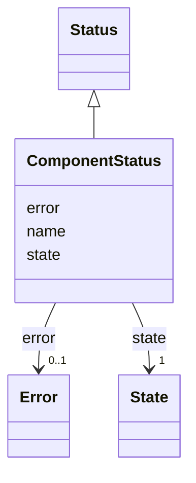

# Class: ComponentStatus 


_Status of a component deployment._


<!--
URI: [https://specification.margo.org/data-model/ComponentStatus](https://specification.margo.org/data-model/ComponentStatus)
-->





## Inheritance
* [Status](Status.md)
    * **ComponentStatus**


## Attributes

| Name | Cardinality and Range | Description | Inheritance |
| ---  | --- | --- | --- |
| [name](name.md) | 1 <br/> [string](string.md) |  | direct |
| [state](state.md) | 1 <br/> [State](State.md) |  | [Status](Status.md) |
| [error](error.md) | 0..1 <br/> [Error](Error.md) |  | [Status](Status.md) |


## Usages

| used by | used in | type | used |
| ---  | --- | --- | --- |
| [DeploymentStatusManifest](DeploymentStatusManifest.md) | [components](components.md) | range | [ComponentStatus](ComponentStatus.md) |


<!--
## Identifier and Mapping Information


### Schema Source


* from schema: https://specification.margo.org/data-model


## Mappings

| Mapping Type | Mapped Value |
| ---  | ---  |
| self | https://specification.margo.org/data-model/ComponentStatus |
| native | https://specification.margo.org/data-model/ComponentStatus |


-->


??? note "Only relevant for contributors of the specification"

    ## LinkML Source

    <!-- TODO: investigate https://stackoverflow.com/questions/37606292/how-to-create-tabbed-code-blocks-in-mkdocs-or-sphinx -->

    ### Direct

    ??? note "Details"
        ```yaml
        name: ComponentStatus
        description: Status of a component deployment.
        from_schema: https://specification.margo.org/data-model
        is_a: Status
        attributes:
          name:
            name: name
            from_schema: https://specification.margo.org/deployment-status
            domain_of:
            - Component
            - Parameter
            - DeploymentMetadata
            - ApplicationMetadata
            - Author
            - Organization
            - Section
            - Setting
            - Schema
            - ComponentStatus
            range: string
            required: true

        ```

    ### Induced

    ??? note "Details"
        ```yaml
        name: ComponentStatus
        description: Status of a component deployment.
        from_schema: https://specification.margo.org/data-model
        is_a: Status
        attributes:
          name:
            name: name
            from_schema: https://specification.margo.org/deployment-status
            alias: name
            owner: ComponentStatus
            domain_of:
            - Component
            - Parameter
            - DeploymentMetadata
            - ApplicationMetadata
            - Author
            - Organization
            - Section
            - Setting
            - Schema
            - ComponentStatus
            range: string
            required: true
          state:
            name: state
            from_schema: https://specification.margo.org/data-model
            rank: 1000
            alias: state
            owner: ComponentStatus
            domain_of:
            - Status
            range: State
            required: true
          error:
            name: error
            from_schema: https://specification.margo.org/data-model
            rank: 1000
            alias: error
            owner: ComponentStatus
            domain_of:
            - Status
            range: Error

        ```