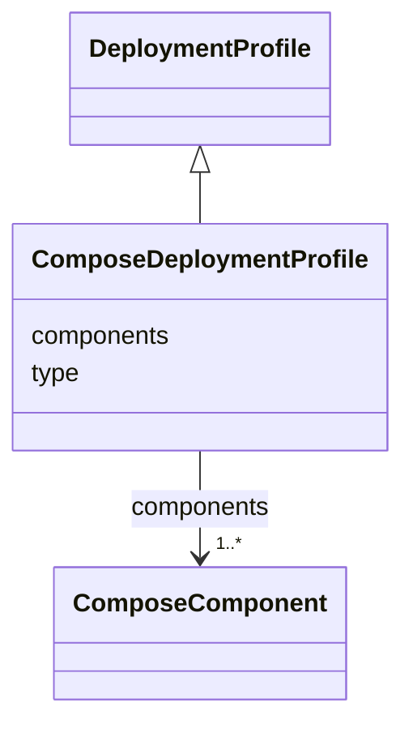

# Class: ComposeDeploymentProfile 


<!--
URI: [https://specification.margo.org/data-model/ComposeDeploymentProfile](https://specification.margo.org/data-model/ComposeDeploymentProfile)
-->





## Inheritance
* [DeploymentProfile](DeploymentProfile.md)
    * **ComposeDeploymentProfile**


## Attributes

| Name | Cardinality and Range | Description | Inheritance |
| ---  | --- | --- | --- |
| [type](type.md) | 1 <br/> [string](string.md) | Defines the type of this deployment configuration for the application | [DeploymentProfile](DeploymentProfile.md) |
| [components](components.md) | 1..* <br/> [ComposeComponent](ComposeComponent.md) | Component element indicating the components to deploy when installing the app... | [DeploymentProfile](DeploymentProfile.md) |


<!--
## Identifier and Mapping Information


### Schema Source


* from schema: https://specification.margo.org/data-model


## Mappings

| Mapping Type | Mapped Value |
| ---  | ---  |
| self | https://specification.margo.org/data-model/ComposeDeploymentProfile |
| native | https://specification.margo.org/data-model/ComposeDeploymentProfile |


-->


??? note "Only relevant for contributors of the specification"

    ## LinkML Source

    <!-- TODO: investigate https://stackoverflow.com/questions/37606292/how-to-create-tabbed-code-blocks-in-mkdocs-or-sphinx -->

    ### Direct

    ??? note "Details"
        ```yaml
        name: ComposeDeploymentProfile
        from_schema: https://specification.margo.org/data-model
        is_a: DeploymentProfile
        slot_usage:
          type:
            name: type
            equals_string: compose
          components:
            name: components
            range: ComposeComponent

        ```

    ### Induced

    ??? note "Details"
        ```yaml
        name: ComposeDeploymentProfile
        from_schema: https://specification.margo.org/data-model
        is_a: DeploymentProfile
        slot_usage:
          type:
            name: type
            equals_string: compose
          components:
            name: components
            range: ComposeComponent
        attributes:
          type:
            name: type
            description: Defines the type of this deployment configuration for the application.  The
              allowed values are `helm.v3`, to indicate the deployment profile's format is
              Helm version 3,  and `compose` to indicate the deployment profile's format is
              a Compose file.  When installing the application on a device supporting the
              Kubernetes platform, all `helm.v3` components,  and only `helm.v3` components,
              will be provided to the device in same order they are listed in the application
              description file.  When installing the application on a device supporting Compose,
              all `compose` components,  and only `compose` components, will be provided to
              the device in the same order they are listed in the application description
              file.  The device will install the components in the same order they are listed
              in the application description file.
            from_schema: https://specification.margo.org/data-model
            rank: 1000
            alias: type
            owner: ComposeDeploymentProfile
            domain_of:
            - DeploymentProfile
            - Peripheral
            - CommunicationInterface
            range: string
            required: true
            pattern: ^(helm\.v3|compose)$
            equals_string: compose
          components:
            name: components
            description: Component element indicating the components to deploy when installing
              the application.  See the [Component](#component-attributes) section below.
            from_schema: https://specification.margo.org/data-model
            rank: 1000
            alias: components
            owner: ComposeDeploymentProfile
            domain_of:
            - DeploymentProfile
            - Target
            - DeploymentStatusManifest
            range: ComposeComponent
            required: true
            multivalued: true
            inlined: true
            inlined_as_list: true

        ```