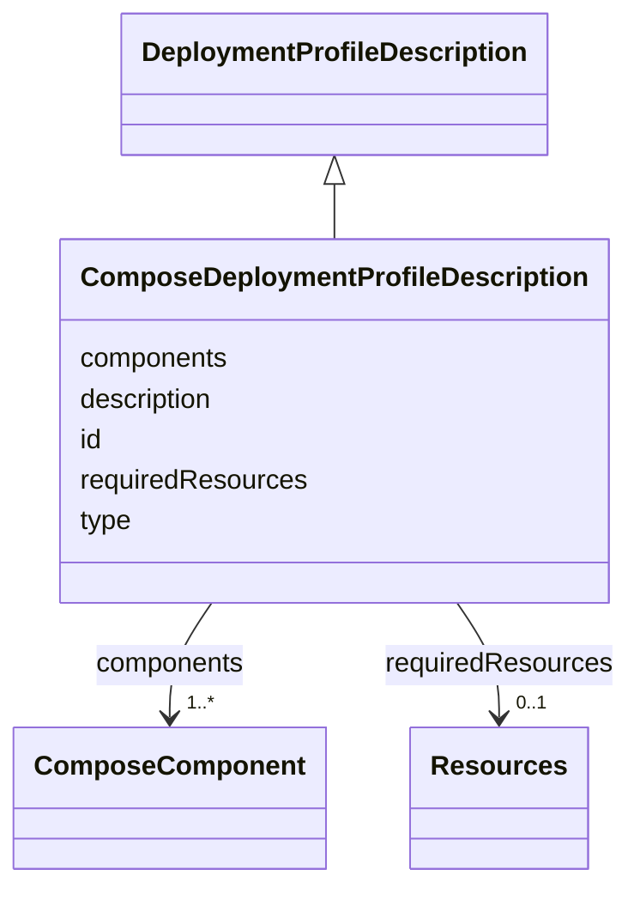

# Class: ComposeDeploymentProfileDescription 


<!--
URI: [https://specification.margo.org/data-model/ComposeDeploymentProfileDescription](https://specification.margo.org/data-model/ComposeDeploymentProfileDescription)
-->





## Inheritance
* [DeploymentProfile](DeploymentProfile.md)
    * [DeploymentProfileDescription](DeploymentProfileDescription.md)
        * **ComposeDeploymentProfileDescription**


## Attributes

| Name | Cardinality and Range | Description | Inheritance |
| ---  | --- | --- | --- |
| [id](id.md) | 1 <br/> [string](string.md) | An identifier for the deployment profile, given by the application developer,... | [DeploymentProfileDescription](DeploymentProfileDescription.md) |
| [description](description.md) | 0..1 <br/> [string](string.md) | This human-readable description of a deployment profile allows for providing ... | [DeploymentProfileDescription](DeploymentProfileDescription.md) |
| [requiredResources](requiredResources.md) | 0..1 <br/> [Resources](Resources.md) | Required resources element specifying the resources required to install the a... | [DeploymentProfileDescription](DeploymentProfileDescription.md) |
| [type](type.md) | 1 <br/> [string](string.md) | Defines the type of this deployment configuration for the application | [DeploymentProfile](DeploymentProfile.md) |
| [components](components.md) | 1..* <br/> [ComposeComponent](ComposeComponent.md) | Component element indicating the components to deploy when installing the app... | [DeploymentProfile](DeploymentProfile.md) |


<!--
## Identifier and Mapping Information


### Schema Source


* from schema: https://specification.margo.org/data-model


## Mappings

| Mapping Type | Mapped Value |
| ---  | ---  |
| self | https://specification.margo.org/data-model/ComposeDeploymentProfileDescription |
| native | https://specification.margo.org/data-model/ComposeDeploymentProfileDescription |


-->


??? note "Only relevant for contributors of the specification"

    ## LinkML Source

    <!-- TODO: investigate https://stackoverflow.com/questions/37606292/how-to-create-tabbed-code-blocks-in-mkdocs-or-sphinx -->

    ### Direct

    ??? note "Details"
        ```yaml
        name: ComposeDeploymentProfileDescription
        from_schema: https://specification.margo.org/data-model
        is_a: DeploymentProfileDescription
        slot_usage:
          type:
            name: type
            equals_string: compose
          components:
            name: components
            range: ComposeComponent

        ```

    ### Induced

    ??? note "Details"
        ```yaml
        name: ComposeDeploymentProfileDescription
        from_schema: https://specification.margo.org/data-model
        is_a: DeploymentProfileDescription
        slot_usage:
          type:
            name: type
            equals_string: compose
          components:
            name: components
            range: ComposeComponent
        attributes:
          id:
            name: id
            description: An identifier for the deployment profile, given by the application
              developer, used to uniquely identify this deployment profile from others within
              this application description's scope.
            from_schema: https://specification.margo.org/application-schema
            alias: id
            owner: ComposeDeploymentProfileDescription
            domain_of:
            - DeploymentAnnotations
            - ApplicationMetadata
            - DeploymentProfileDescription
            - Properties
            range: string
            required: true
          description:
            name: description
            description: This human-readable description of a deployment profile allows for
              providing additional context about the deployment profile. E.g., the application
              developer can use this to describe the deployment profile's purpose, such as
              the intended use case. Additionally, the application developer can use this
              to provide further details about the resources, peripherals, and interfaces
              required to run the application.
            from_schema: https://specification.margo.org/application-schema
            alias: description
            owner: ComposeDeploymentProfileDescription
            domain_of:
            - ApplicationMetadata
            - DeploymentProfileDescription
            - Setting
            range: string
            required: false
          requiredResources:
            name: requiredResources
            description: Required resources element specifying the resources required to install
              the application. See the [Required Resources](#requiredresources-attributes)
              section below. The consequences (e.g., aborting / blocking the installation
              or execution of the application) of not meeting these required resources are
              not defined (yet) by margo.
            from_schema: https://specification.margo.org/application-schema
            rank: 1000
            alias: requiredResources
            owner: ComposeDeploymentProfileDescription
            domain_of:
            - DeploymentProfileDescription
            range: Resources
            required: false
          type:
            name: type
            description: Defines the type of this deployment configuration for the application.  The
              allowed values are `helm.v3`, to indicate the deployment profile's format is
              Helm version 3,  and `compose` to indicate the deployment profile's format is
              a Compose file.  When installing the application on a device supporting the
              Kubernetes platform, all `helm.v3` components,  and only `helm.v3` components,
              will be provided to the device in same order they are listed in the application
              description file.  When installing the application on a device supporting Compose,
              all `compose` components,  and only `compose` components, will be provided to
              the device in the same order they are listed in the application description
              file.  The device will install the components in the same order they are listed
              in the application description file.
            from_schema: https://specification.margo.org/data-model
            rank: 1000
            alias: type
            owner: ComposeDeploymentProfileDescription
            domain_of:
            - DeploymentProfile
            - Peripheral
            - CommunicationInterface
            range: string
            required: true
            pattern: ^(helm\.v3|compose)$
            equals_string: compose
          components:
            name: components
            description: Component element indicating the components to deploy when installing
              the application.  See the [Component](#component-attributes) section below.
            from_schema: https://specification.margo.org/data-model
            rank: 1000
            alias: components
            owner: ComposeDeploymentProfileDescription
            domain_of:
            - DeploymentProfile
            - Target
            - DeploymentStatusManifest
            range: ComposeComponent
            required: true
            multivalued: true
            inlined: true
            inlined_as_list: true

        ```