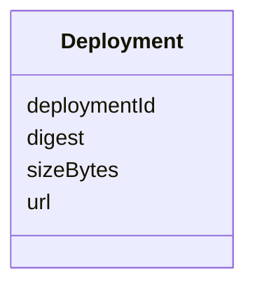

# Class: Deployment 


_List of deployment objects describing each workload._


<!--
URI: [https://specification.margo.org/data-model/Deployment](https://specification.margo.org/data-model/Deployment)
-->





<!-- no inheritance hierarchy -->

## Attributes

| Name | Cardinality and Range | Description | Inheritance |
| ---  | --- | --- | --- |
| [deploymentId](deploymentId.md) | 1 <br/> [string](string.md) | The UUID of the deployment | direct |
| [digest](digest.md) | 1 <br/> [DigestType](DigestType.md) | Digest of the corresponding ApplicationDeployment YAML file | direct |
| [sizeBytes](sizeBytes.md) | 0..1 <br/> [SizeBytesType](SizeBytesType.md) | Optional unsigned 64-bit advisory estimate of the decoded payload length in b... | direct |
| [url](url.md) | 1 <br/> [UrlType](UrlType.md) | Content-addressable retrieval endpoint for the ApplicationDeployment YAML of ... | direct |


## Usages

| used by | used in | type | used |
| ---  | --- | --- | --- |
| [DesiredStateManifest](DesiredStateManifest.md) | [deployments](deployments.md) | range | [Deployment](Deployment.md) |


<!--
## Identifier and Mapping Information


### Schema Source


* from schema: https://specification.margo.org/data-model


## Mappings

| Mapping Type | Mapped Value |
| ---  | ---  |
| self | https://specification.margo.org/data-model/Deployment |
| native | https://specification.margo.org/data-model/Deployment |


-->


??? note "Only relevant for contributors of the specification"

    ## LinkML Source

    <!-- TODO: investigate https://stackoverflow.com/questions/37606292/how-to-create-tabbed-code-blocks-in-mkdocs-or-sphinx -->

    ### Direct

    ??? note "Details"
        ```yaml
        name: Deployment
        description: List of deployment objects describing each workload.
        from_schema: https://specification.margo.org/data-model
        attributes:
          deploymentId:
            name: deploymentId
            description: The UUID of the deployment. MUST equal metadata.annotations.id in
              the ApplicationDeployment.
            from_schema: https://specification.margo.org/desired-state-manifest-schema
            rank: 1000
            domain_of:
            - Deployment
            - DeploymentStatusManifest
            range: string
            required: true
          digest:
            name: digest
            description: "Digest of the corresponding ApplicationDeployment YAML file.\n MUST\
              \ equal the digest computed over the exact sequence of bytes in the individual\
              \ deployment endpoint's HTTP 200 OK response body.\n See Protocol - Digest for\
              \ further details."
            from_schema: https://specification.margo.org/desired-state-manifest-schema
            domain_of:
            - Bundle
            - Deployment
            range: DigestType
            required: true
          sizeBytes:
            name: sizeBytes
            description: Optional unsigned 64-bit advisory estimate of the decoded payload
              length in bytes for the ApplicationDeployment YAML. Provided for bandwidth estimation
              and update planning. MUST NOT be used for integrity verification.
            from_schema: https://specification.margo.org/desired-state-manifest-schema
            domain_of:
            - Bundle
            - Deployment
            range: SizeBytesType
          url:
            name: url
            description: Content-addressable retrieval endpoint for the ApplicationDeployment
              YAML of the form /api/v1/clients/{clientId}/deployments/{deploymentId}/{digest}
              where {digest} equals deployments[].digest.
            from_schema: https://specification.margo.org/desired-state-manifest-schema
            domain_of:
            - Bundle
            - Deployment
            range: UrlType
            required: true

        ```

    ### Induced

    ??? note "Details"
        ```yaml
        name: Deployment
        description: List of deployment objects describing each workload.
        from_schema: https://specification.margo.org/data-model
        attributes:
          deploymentId:
            name: deploymentId
            description: The UUID of the deployment. MUST equal metadata.annotations.id in
              the ApplicationDeployment.
            from_schema: https://specification.margo.org/desired-state-manifest-schema
            rank: 1000
            alias: deploymentId
            owner: Deployment
            domain_of:
            - Deployment
            - DeploymentStatusManifest
            range: string
            required: true
          digest:
            name: digest
            description: "Digest of the corresponding ApplicationDeployment YAML file.\n MUST\
              \ equal the digest computed over the exact sequence of bytes in the individual\
              \ deployment endpoint's HTTP 200 OK response body.\n See Protocol - Digest for\
              \ further details."
            from_schema: https://specification.margo.org/desired-state-manifest-schema
            alias: digest
            owner: Deployment
            domain_of:
            - Bundle
            - Deployment
            range: DigestType
            required: true
          sizeBytes:
            name: sizeBytes
            description: Optional unsigned 64-bit advisory estimate of the decoded payload
              length in bytes for the ApplicationDeployment YAML. Provided for bandwidth estimation
              and update planning. MUST NOT be used for integrity verification.
            from_schema: https://specification.margo.org/desired-state-manifest-schema
            alias: sizeBytes
            owner: Deployment
            domain_of:
            - Bundle
            - Deployment
            range: SizeBytesType
          url:
            name: url
            description: Content-addressable retrieval endpoint for the ApplicationDeployment
              YAML of the form /api/v1/clients/{clientId}/deployments/{deploymentId}/{digest}
              where {digest} equals deployments[].digest.
            from_schema: https://specification.margo.org/desired-state-manifest-schema
            alias: url
            owner: Deployment
            domain_of:
            - Bundle
            - Deployment
            range: UrlType
            required: true

        ```