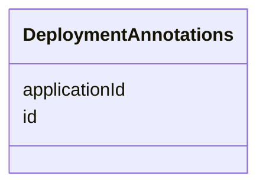

# Class: DeploymentAnnotations 


_A class representing annotations._


<!--
URI: [https://specification.margo.org/data-model/DeploymentAnnotations](https://specification.margo.org/data-model/DeploymentAnnotations)
-->





<!-- no inheritance hierarchy -->

## Attributes

| Name | Cardinality and Range | Description | Inheritance |
| ---  | --- | --- | --- |
| [applicationId](applicationId.md) | 1 <br/> [string](string.md) | An identifier for the application | direct |
| [id](id.md) | 1 <br/> [string](string.md) | The unique identifier UUID of the deployment specification | direct |


## Usages

| used by | used in | type | used |
| ---  | --- | --- | --- |
| [DeploymentMetadata](DeploymentMetadata.md) | [annotations](annotations.md) | range | [DeploymentAnnotations](DeploymentAnnotations.md) |


<!--
## Identifier and Mapping Information


### Schema Source


* from schema: https://specification.margo.org/data-model


## Mappings

| Mapping Type | Mapped Value |
| ---  | ---  |
| self | https://specification.margo.org/data-model/DeploymentAnnotations |
| native | https://specification.margo.org/data-model/DeploymentAnnotations |


-->


??? note "Only relevant for contributors of the specification"

    ## LinkML Source

    <!-- TODO: investigate https://stackoverflow.com/questions/37606292/how-to-create-tabbed-code-blocks-in-mkdocs-or-sphinx -->

    ### Direct

    ??? note "Details"
        ```yaml
        name: DeploymentAnnotations
        description: A class representing annotations.
        from_schema: https://specification.margo.org/data-model
        attributes:
          applicationId:
            name: applicationId
            description: An identifier for the application. The id is used to help create
              unique identifiers where required, such as namespaces. The id must be lower
              case letters and numbers and MAY contain dashes. Uppercase letters, underscores
              and periods MUST NOT be used. The id MUST NOT be more than 200 characters. The
              applicationId MUST match the associated application package Metadata "id" attribute.
            from_schema: https://specification.margo.org/application_deployment_schema
            rank: 1000
            domain_of:
            - DeploymentAnnotations
            range: string
            required: true
            pattern: ^[-a-z0-9]{1,200}$
          id:
            name: id
            description: The unique identifier UUID of the deployment specification. Needs
              to be assigned by the Workload Orchestration Software.
            from_schema: https://specification.margo.org/application_deployment_schema
            rank: 1000
            domain_of:
            - DeploymentAnnotations
            - ApplicationMetadata
            - DeploymentProfileDescription
            - Properties
            range: string
            required: true
            pattern: ^[0-9a-fA-F]{8}-[0-9a-fA-F]{4}-[0-9a-fA-F]{4}-[0-9a-fA-F]{4}-[0-9a-fA-F]{12}$

        ```

    ### Induced

    ??? note "Details"
        ```yaml
        name: DeploymentAnnotations
        description: A class representing annotations.
        from_schema: https://specification.margo.org/data-model
        attributes:
          applicationId:
            name: applicationId
            description: An identifier for the application. The id is used to help create
              unique identifiers where required, such as namespaces. The id must be lower
              case letters and numbers and MAY contain dashes. Uppercase letters, underscores
              and periods MUST NOT be used. The id MUST NOT be more than 200 characters. The
              applicationId MUST match the associated application package Metadata "id" attribute.
            from_schema: https://specification.margo.org/application_deployment_schema
            rank: 1000
            alias: applicationId
            owner: DeploymentAnnotations
            domain_of:
            - DeploymentAnnotations
            range: string
            required: true
            pattern: ^[-a-z0-9]{1,200}$
          id:
            name: id
            description: The unique identifier UUID of the deployment specification. Needs
              to be assigned by the Workload Orchestration Software.
            from_schema: https://specification.margo.org/application_deployment_schema
            rank: 1000
            alias: id
            owner: DeploymentAnnotations
            domain_of:
            - DeploymentAnnotations
            - ApplicationMetadata
            - DeploymentProfileDescription
            - Properties
            range: string
            required: true
            pattern: ^[0-9a-fA-F]{8}-[0-9a-fA-F]{4}-[0-9a-fA-F]{4}-[0-9a-fA-F]{4}-[0-9a-fA-F]{12}$

        ```