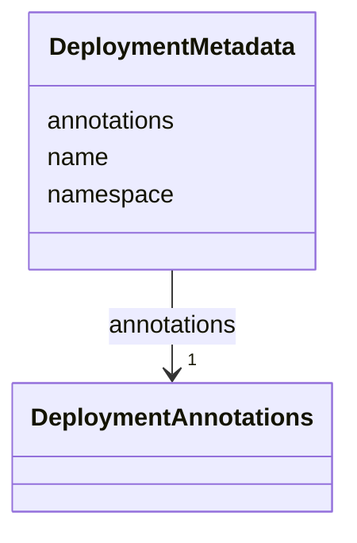

# Class: DeploymentMetadata 


_Metadata associated with the desired state._


<!--
URI: [https://specification.margo.org/data-model/DeploymentMetadata](https://specification.margo.org/data-model/DeploymentMetadata)
-->





<!-- no inheritance hierarchy -->

## Attributes

| Name | Cardinality and Range | Description | Inheritance |
| ---  | --- | --- | --- |
| [annotations](annotations.md) | 1 <br/> [DeploymentAnnotations](DeploymentAnnotations.md) | Defines the application ID and unique identifier associated to the deployment... | direct |
| [name](name.md) | 1 <br/> [string](string.md) | When deploying to Kubernetes, the manifests name | direct |
| [namespace](namespace.md) | 1 <br/> [string](string.md) | When deploying to Kubernetes, the namespace the manifest is added under | direct |


## Usages

| used by | used in | type | used |
| ---  | --- | --- | --- |
| [ApplicationDeployment](ApplicationDeployment.md) | [metadata](metadata.md) | range | [DeploymentMetadata](DeploymentMetadata.md) |


<!--
## Identifier and Mapping Information


### Schema Source


* from schema: https://specification.margo.org/data-model


## Mappings

| Mapping Type | Mapped Value |
| ---  | ---  |
| self | https://specification.margo.org/data-model/DeploymentMetadata |
| native | https://specification.margo.org/data-model/DeploymentMetadata |


-->


??? note "Only relevant for contributors of the specification"

    ## LinkML Source

    <!-- TODO: investigate https://stackoverflow.com/questions/37606292/how-to-create-tabbed-code-blocks-in-mkdocs-or-sphinx -->

    ### Direct

    ??? note "Details"
        ```yaml
        name: DeploymentMetadata
        description: Metadata associated with the desired state.
        from_schema: https://specification.margo.org/data-model
        attributes:
          annotations:
            name: annotations
            description: Defines the application ID and unique identifier associated to the
              deployment specification. Needs to be assigned by the Workload Orchestration
              Software. See the [Annotation Attributes](#annotations-attributes) section below.
            from_schema: https://specification.margo.org/application_deployment_schema
            rank: 1000
            domain_of:
            - DeploymentMetadata
            range: DeploymentAnnotations
            required: true
          name:
            name: name
            description: When deploying to Kubernetes, the manifests name. The name is chosen
              by the workload orchestration vendor and is not displayed anywhere.
            from_schema: https://specification.margo.org/application_deployment_schema
            domain_of:
            - Component
            - Parameter
            - DeploymentMetadata
            - ApplicationMetadata
            - Author
            - Organization
            - Section
            - Setting
            - Schema
            - ComponentStatus
            range: string
            required: true
          namespace:
            name: namespace
            description: When deploying to Kubernetes, the namespace the manifest is added
              under. The namespace is chosen by the workload orchestration solution vendor.
            from_schema: https://specification.margo.org/application_deployment_schema
            rank: 1000
            domain_of:
            - DeploymentMetadata
            range: string
            required: true

        ```

    ### Induced

    ??? note "Details"
        ```yaml
        name: DeploymentMetadata
        description: Metadata associated with the desired state.
        from_schema: https://specification.margo.org/data-model
        attributes:
          annotations:
            name: annotations
            description: Defines the application ID and unique identifier associated to the
              deployment specification. Needs to be assigned by the Workload Orchestration
              Software. See the [Annotation Attributes](#annotations-attributes) section below.
            from_schema: https://specification.margo.org/application_deployment_schema
            rank: 1000
            alias: annotations
            owner: DeploymentMetadata
            domain_of:
            - DeploymentMetadata
            range: DeploymentAnnotations
            required: true
          name:
            name: name
            description: When deploying to Kubernetes, the manifests name. The name is chosen
              by the workload orchestration vendor and is not displayed anywhere.
            from_schema: https://specification.margo.org/application_deployment_schema
            alias: name
            owner: DeploymentMetadata
            domain_of:
            - Component
            - Parameter
            - DeploymentMetadata
            - ApplicationMetadata
            - Author
            - Organization
            - Section
            - Setting
            - Schema
            - ComponentStatus
            range: string
            required: true
          namespace:
            name: namespace
            description: When deploying to Kubernetes, the namespace the manifest is added
              under. The namespace is chosen by the workload orchestration solution vendor.
            from_schema: https://specification.margo.org/application_deployment_schema
            rank: 1000
            alias: namespace
            owner: DeploymentMetadata
            domain_of:
            - DeploymentMetadata
            range: string
            required: true

        ```