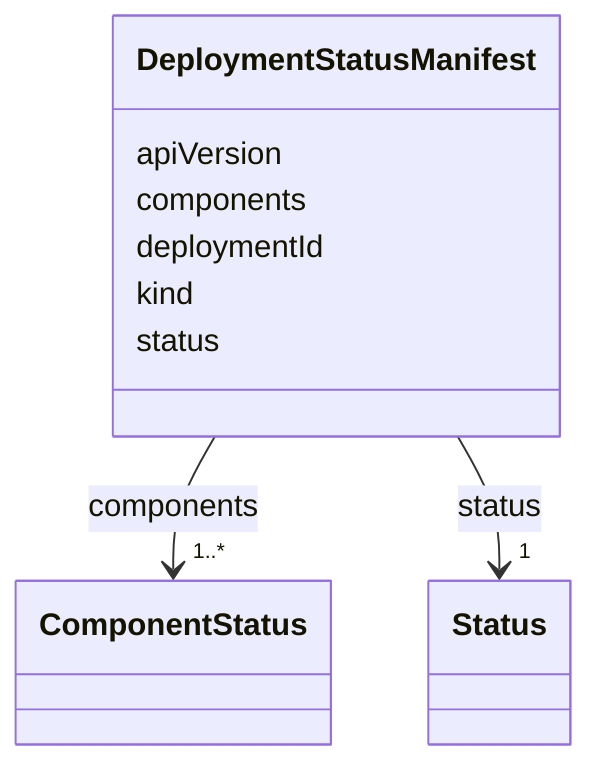

# Class: DeploymentStatusManifest 


<!--
URI: [https://specification.margo.org/data-model/DeploymentStatusManifest](https://specification.margo.org/data-model/DeploymentStatusManifest)
-->





<!-- no inheritance hierarchy -->

## Attributes

| Name | Cardinality and Range | Description | Inheritance |
| ---  | --- | --- | --- |
| [apiVersion](apiVersion.md) | 1 <br/> [string](string.md) |  | direct |
| [kind](kind.md) | 1 <br/> [string](string.md) |  | direct |
| [deploymentId](deploymentId.md) | 1 <br/> [string](string.md) |  | direct |
| [status](status.md) | 1 <br/> [Status](Status.md) |  | direct |
| [components](components.md) | 1..* <br/> [ComponentStatus](ComponentStatus.md) |  | direct |


<!--
## Identifier and Mapping Information


### Schema Source


* from schema: https://specification.margo.org/data-model


## Mappings

| Mapping Type | Mapped Value |
| ---  | ---  |
| self | https://specification.margo.org/data-model/DeploymentStatusManifest |
| native | https://specification.margo.org/data-model/DeploymentStatusManifest |


-->


??? note "Only relevant for contributors of the specification"

    ## LinkML Source

    <!-- TODO: investigate https://stackoverflow.com/questions/37606292/how-to-create-tabbed-code-blocks-in-mkdocs-or-sphinx -->

    ### Direct

    ??? note "Details"
        ```yaml
        name: DeploymentStatusManifest
        from_schema: https://specification.margo.org/data-model
        attributes:
          apiVersion:
            name: apiVersion
            from_schema: https://specification.margo.org/deployment-status
            domain_of:
            - ApplicationDeployment
            - ApplicationDescription
            - DeviceCapabilitiesManifest
            - DeploymentStatusManifest
            range: string
            required: true
          kind:
            name: kind
            from_schema: https://specification.margo.org/deployment-status
            designates_type: true
            domain_of:
            - ApplicationDeployment
            - ApplicationDescription
            - DeviceCapabilitiesManifest
            - DeploymentStatusManifest
            range: string
            required: true
            equals_string: DeploymentStatusManifest
          deploymentId:
            name: deploymentId
            from_schema: https://specification.margo.org/deployment-status
            domain_of:
            - Deployment
            - DeploymentStatusManifest
            range: string
            required: true
          status:
            name: status
            from_schema: https://specification.margo.org/deployment-status
            rank: 1000
            domain_of:
            - DeploymentStatusManifest
            range: Status
            required: true
          components:
            name: components
            from_schema: https://specification.margo.org/deployment-status
            domain_of:
            - DeploymentProfile
            - Target
            - DeploymentStatusManifest
            range: ComponentStatus
            required: true
            multivalued: true

        ```

    ### Induced

    ??? note "Details"
        ```yaml
        name: DeploymentStatusManifest
        from_schema: https://specification.margo.org/data-model
        attributes:
          apiVersion:
            name: apiVersion
            from_schema: https://specification.margo.org/deployment-status
            alias: apiVersion
            owner: DeploymentStatusManifest
            domain_of:
            - ApplicationDeployment
            - ApplicationDescription
            - DeviceCapabilitiesManifest
            - DeploymentStatusManifest
            range: string
            required: true
          kind:
            name: kind
            from_schema: https://specification.margo.org/deployment-status
            designates_type: true
            alias: kind
            owner: DeploymentStatusManifest
            domain_of:
            - ApplicationDeployment
            - ApplicationDescription
            - DeviceCapabilitiesManifest
            - DeploymentStatusManifest
            range: string
            required: true
            equals_string: DeploymentStatusManifest
          deploymentId:
            name: deploymentId
            from_schema: https://specification.margo.org/deployment-status
            alias: deploymentId
            owner: DeploymentStatusManifest
            domain_of:
            - Deployment
            - DeploymentStatusManifest
            range: string
            required: true
          status:
            name: status
            from_schema: https://specification.margo.org/deployment-status
            rank: 1000
            alias: status
            owner: DeploymentStatusManifest
            domain_of:
            - DeploymentStatusManifest
            range: Status
            required: true
          components:
            name: components
            from_schema: https://specification.margo.org/deployment-status
            alias: components
            owner: DeploymentStatusManifest
            domain_of:
            - DeploymentProfile
            - Target
            - DeploymentStatusManifest
            range: ComponentStatus
            required: true
            multivalued: true

        ```