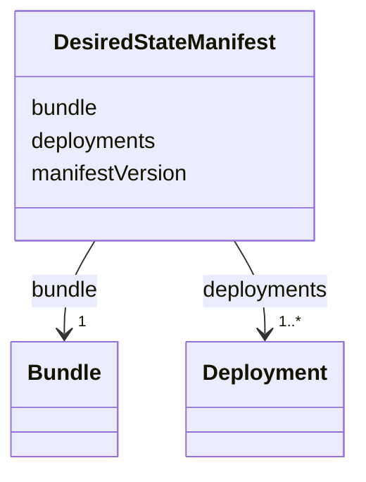

# Class: DesiredStateManifest 


_Manifest from the Workload Fleet Manager, representing the complete desired workload configuration assigned to the device._


<!--
URI: [https://specification.margo.org/data-model/DesiredStateManifest](https://specification.margo.org/data-model/DesiredStateManifest)
-->





<!-- no inheritance hierarchy -->

## Attributes

| Name | Cardinality and Range | Description | Inheritance |
| ---  | --- | --- | --- |
| [manifestVersion](manifestVersion.md) | 1 <br/> [integer](integer.md) |  | direct |
| [bundle](bundle.md) | 1 <br/> [Bundle](Bundle.md) | Package optimization containing multiple ApplicationDeployment YAMLs | direct |
| [deployments](deployments.md) | 1..* <br/> [Deployment](Deployment.md) | List of deployment objects describing each workload | direct |


<!--
## Identifier and Mapping Information


### Schema Source


* from schema: https://specification.margo.org/data-model


## Mappings

| Mapping Type | Mapped Value |
| ---  | ---  |
| self | https://specification.margo.org/data-model/DesiredStateManifest |
| native | https://specification.margo.org/data-model/DesiredStateManifest |


-->


??? note "Only relevant for contributors of the specification"

    ## LinkML Source

    <!-- TODO: investigate https://stackoverflow.com/questions/37606292/how-to-create-tabbed-code-blocks-in-mkdocs-or-sphinx -->

    ### Direct

    ??? note "Details"
        ```yaml
        name: DesiredStateManifest
        description: Manifest from the Workload Fleet Manager, representing the complete desired
          workload configuration assigned to the device.
        from_schema: https://specification.margo.org/data-model
        attributes:
          manifestVersion:
            name: manifestVersion
            from_schema: https://specification.margo.org/desired-state-manifest-schema
            rank: 1000
            domain_of:
            - DesiredStateManifest
            range: integer
            required: true
            minimum_value: 1
          bundle:
            name: bundle
            description: Package optimization containing multiple ApplicationDeployment YAMLs.
            from_schema: https://specification.margo.org/desired-state-manifest-schema
            rank: 1000
            domain_of:
            - DesiredStateManifest
            range: Bundle
            required: true
          deployments:
            name: deployments
            description: List of deployment objects describing each workload.
            from_schema: https://specification.margo.org/desired-state-manifest-schema
            rank: 1000
            domain_of:
            - DesiredStateManifest
            range: Deployment
            required: true
            multivalued: true
            inlined: true
            inlined_as_list: true

        ```

    ### Induced

    ??? note "Details"
        ```yaml
        name: DesiredStateManifest
        description: Manifest from the Workload Fleet Manager, representing the complete desired
          workload configuration assigned to the device.
        from_schema: https://specification.margo.org/data-model
        attributes:
          manifestVersion:
            name: manifestVersion
            from_schema: https://specification.margo.org/desired-state-manifest-schema
            rank: 1000
            alias: manifestVersion
            owner: DesiredStateManifest
            domain_of:
            - DesiredStateManifest
            range: integer
            required: true
            minimum_value: 1
          bundle:
            name: bundle
            description: Package optimization containing multiple ApplicationDeployment YAMLs.
            from_schema: https://specification.margo.org/desired-state-manifest-schema
            rank: 1000
            alias: bundle
            owner: DesiredStateManifest
            domain_of:
            - DesiredStateManifest
            range: Bundle
            required: true
          deployments:
            name: deployments
            description: List of deployment objects describing each workload.
            from_schema: https://specification.margo.org/desired-state-manifest-schema
            rank: 1000
            alias: deployments
            owner: DesiredStateManifest
            domain_of:
            - DesiredStateManifest
            range: Deployment
            required: true
            multivalued: true
            inlined: true
            inlined_as_list: true

        ```