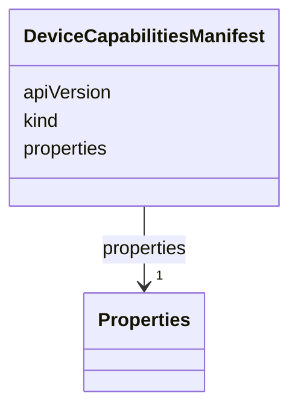

# Class: DeviceCapabilitiesManifest 


_Capabilities of a device on which applications can be deployed._


<!--
URI: [https://specification.margo.org/data-model/DeviceCapabilitiesManifest](https://specification.margo.org/data-model/DeviceCapabilitiesManifest)
-->





<!-- no inheritance hierarchy -->

## Attributes

| Name | Cardinality and Range | Description | Inheritance |
| ---  | --- | --- | --- |
| [apiVersion](apiVersion.md) | 1 <br/> [string](string.md) | Identifier of the version the API resource follows | direct |
| [kind](kind.md) | 1 <br/> [string](string.md) | Must be `DeviceCapabilitiesManifest` | direct |
| [properties](properties.md) | 1 <br/> [Properties](Properties.md) | Element that defines characteristics about the device | direct |


<!--
## Identifier and Mapping Information


### Schema Source


* from schema: https://specification.margo.org/data-model


## Mappings

| Mapping Type | Mapped Value |
| ---  | ---  |
| self | https://specification.margo.org/data-model/DeviceCapabilitiesManifest |
| native | https://specification.margo.org/data-model/DeviceCapabilitiesManifest |


-->


??? note "Only relevant for contributors of the specification"

    ## LinkML Source

    <!-- TODO: investigate https://stackoverflow.com/questions/37606292/how-to-create-tabbed-code-blocks-in-mkdocs-or-sphinx -->

    ### Direct

    ??? note "Details"
        ```yaml
        name: DeviceCapabilitiesManifest
        description: Capabilities of a device on which applications can be deployed.
        from_schema: https://specification.margo.org/data-model
        attributes:
          apiVersion:
            name: apiVersion
            description: Identifier of the version the API resource follows.
            from_schema: https://specification.margo.org/device-capabilities
            domain_of:
            - ApplicationDeployment
            - ApplicationDescription
            - DeviceCapabilitiesManifest
            - DeploymentStatusManifest
            range: string
            required: true
          kind:
            name: kind
            description: Must be `DeviceCapabilitiesManifest`.
            from_schema: https://specification.margo.org/device-capabilities
            designates_type: true
            domain_of:
            - ApplicationDeployment
            - ApplicationDescription
            - DeviceCapabilitiesManifest
            - DeploymentStatusManifest
            range: string
            required: true
            equals_string: DeviceCapabilitiesManifest
          properties:
            name: properties
            description: Element that defines characteristics about the device. See the [Properties
              Attributes](#properties-attributes) section below.
            from_schema: https://specification.margo.org/device-capabilities
            domain_of:
            - Component
            - DeviceCapabilitiesManifest
            range: Properties
            required: true

        ```

    ### Induced

    ??? note "Details"
        ```yaml
        name: DeviceCapabilitiesManifest
        description: Capabilities of a device on which applications can be deployed.
        from_schema: https://specification.margo.org/data-model
        attributes:
          apiVersion:
            name: apiVersion
            description: Identifier of the version the API resource follows.
            from_schema: https://specification.margo.org/device-capabilities
            alias: apiVersion
            owner: DeviceCapabilitiesManifest
            domain_of:
            - ApplicationDeployment
            - ApplicationDescription
            - DeviceCapabilitiesManifest
            - DeploymentStatusManifest
            range: string
            required: true
          kind:
            name: kind
            description: Must be `DeviceCapabilitiesManifest`.
            from_schema: https://specification.margo.org/device-capabilities
            designates_type: true
            alias: kind
            owner: DeviceCapabilitiesManifest
            domain_of:
            - ApplicationDeployment
            - ApplicationDescription
            - DeviceCapabilitiesManifest
            - DeploymentStatusManifest
            range: string
            required: true
            equals_string: DeviceCapabilitiesManifest
          properties:
            name: properties
            description: Element that defines characteristics about the device. See the [Properties
              Attributes](#properties-attributes) section below.
            from_schema: https://specification.margo.org/device-capabilities
            alias: properties
            owner: DeviceCapabilitiesManifest
            domain_of:
            - Component
            - DeviceCapabilitiesManifest
            range: Properties
            required: true

        ```