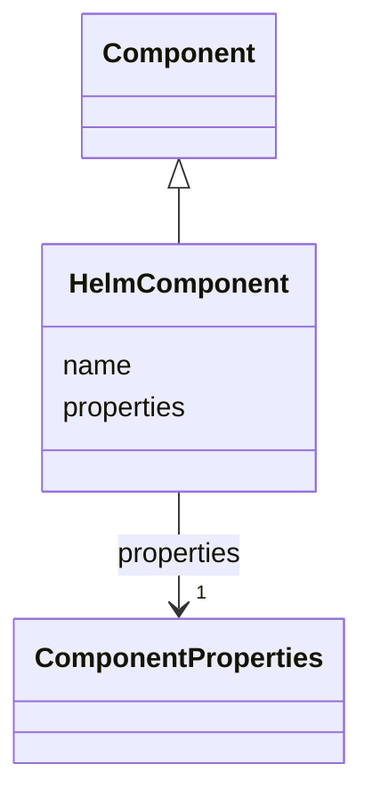

# Class: HelmComponent 


<!--
URI: [https://specification.margo.org/data-model/HelmComponent](https://specification.margo.org/data-model/HelmComponent)
-->





## Inheritance
* [Component](Component.md)
    * **HelmComponent**


## Attributes

| Name | Cardinality and Range | Description | Inheritance |
| ---  | --- | --- | --- |
| [name](name.md) | 1 <br/> [string](string.md) | A unique name used to identify the component package | [Component](Component.md) |
| [properties](properties.md) | 1 <br/> [ComponentProperties](ComponentProperties.md) | A dictionary element specifying the component packages's deployment details | [Component](Component.md) |


## Usages

| used by | used in | type | used |
| ---  | --- | --- | --- |
| [HelmDeploymentProfile](HelmDeploymentProfile.md) | [components](components.md) | range | [HelmComponent](HelmComponent.md) |
| [HelmDeploymentProfileDescription](HelmDeploymentProfileDescription.md) | [components](components.md) | range | [HelmComponent](HelmComponent.md) |


<!--
## Identifier and Mapping Information


### Schema Source


* from schema: https://specification.margo.org/data-model


## Mappings

| Mapping Type | Mapped Value |
| ---  | ---  |
| self | https://specification.margo.org/data-model/HelmComponent |
| native | https://specification.margo.org/data-model/HelmComponent |


-->


??? note "Only relevant for contributors of the specification"

    ## LinkML Source

    <!-- TODO: investigate https://stackoverflow.com/questions/37606292/how-to-create-tabbed-code-blocks-in-mkdocs-or-sphinx -->

    ### Direct

    ??? note "Details"
        ```yaml
        name: HelmComponent
        from_schema: https://specification.margo.org/data-model
        is_a: Component

        ```

    ### Induced

    ??? note "Details"
        ```yaml
        name: HelmComponent
        from_schema: https://specification.margo.org/data-model
        is_a: Component
        attributes:
          name:
            name: name
            description: A unique name used to identify the component package. For helm installations
              the name will be used as the chart name. The name must be lower case letters
              and numbers and MAY contain dashes.  Uppercase letters, underscores and periods
              MUST NOT be used.
            from_schema: https://specification.margo.org/deployments
            rank: 1000
            alias: name
            owner: HelmComponent
            domain_of:
            - Component
            - Parameter
            - DeploymentMetadata
            - ApplicationMetadata
            - Author
            - Organization
            - Section
            - Setting
            - Schema
            - ComponentStatus
            range: string
            required: true
          properties:
            name: properties
            description: A dictionary element specifying the component packages's deployment
              details.  See the [Component Properties](#componentproperties-attributes) section
              below.
            from_schema: https://specification.margo.org/deployments
            rank: 1000
            alias: properties
            owner: HelmComponent
            domain_of:
            - Component
            - DeviceCapabilitiesManifest
            range: ComponentProperties
            required: true

        ```