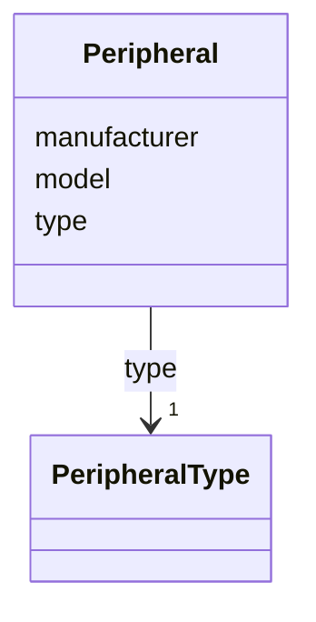

# Class: Peripheral 


_Peripheral hardware of a device._


<!--
URI: [https://specification.margo.org/data-model/Peripheral](https://specification.margo.org/data-model/Peripheral)
-->





<!-- no inheritance hierarchy -->

## Attributes

| Name | Cardinality and Range | Description | Inheritance |
| ---  | --- | --- | --- |
| [type](type.md) | 1 <br/> [PeripheralType](PeripheralType.md) | The type of peripheral | direct |
| [manufacturer](manufacturer.md) | 0..1 <br/> [string](string.md) | The name of the manufacturer | direct |
| [model](model.md) | 0..1 <br/> [string](string.md) | The model of the peripheral | direct |


## Usages

| used by | used in | type | used |
| ---  | --- | --- | --- |
| [Resources](Resources.md) | [peripherals](peripherals.md) | range | [Peripheral](Peripheral.md) |


<!--
## Identifier and Mapping Information


### Schema Source


* from schema: https://specification.margo.org/data-model


## Mappings

| Mapping Type | Mapped Value |
| ---  | ---  |
| self | https://specification.margo.org/data-model/Peripheral |
| native | https://specification.margo.org/data-model/Peripheral |


-->


??? note "Only relevant for contributors of the specification"

    ## LinkML Source

    <!-- TODO: investigate https://stackoverflow.com/questions/37606292/how-to-create-tabbed-code-blocks-in-mkdocs-or-sphinx -->

    ### Direct

    ??? note "Details"
        ```yaml
        name: Peripheral
        description: Peripheral hardware of a device.
        from_schema: https://specification.margo.org/data-model
        attributes:
          type:
            name: type
            description: The type of peripheral. This can be e.g. GPU, display, camera, microphone,
              speaker. See the [PeriperalType](#peripheraltype) definition for all permissible
              values.
            from_schema: https://specification.margo.org/device-resources
            rank: 20
            domain_of:
            - DeploymentProfile
            - Peripheral
            - CommunicationInterface
            range: PeripheralType
            required: true
          manufacturer:
            name: manufacturer
            description: The name of the manufacturer. If `manufacturer` is specified as a
              requirement here, it may be difficult to find devices that can host the  application.
              Please use these requirements with caution.
            from_schema: https://specification.margo.org/device-resources
            rank: 30
            domain_of:
            - Peripheral
            range: string
            required: false
          model:
            name: model
            description: The model of the peripheral. If `model` is specified as a requirement
              here, it may be difficult to find devices that can host the application. Please
              use these requirements with caution.
            from_schema: https://specification.margo.org/device-resources
            rank: 40
            domain_of:
            - Peripheral
            range: string
            required: false

        ```

    ### Induced

    ??? note "Details"
        ```yaml
        name: Peripheral
        description: Peripheral hardware of a device.
        from_schema: https://specification.margo.org/data-model
        attributes:
          type:
            name: type
            description: The type of peripheral. This can be e.g. GPU, display, camera, microphone,
              speaker. See the [PeriperalType](#peripheraltype) definition for all permissible
              values.
            from_schema: https://specification.margo.org/device-resources
            rank: 20
            alias: type
            owner: Peripheral
            domain_of:
            - DeploymentProfile
            - Peripheral
            - CommunicationInterface
            range: PeripheralType
            required: true
          manufacturer:
            name: manufacturer
            description: The name of the manufacturer. If `manufacturer` is specified as a
              requirement here, it may be difficult to find devices that can host the  application.
              Please use these requirements with caution.
            from_schema: https://specification.margo.org/device-resources
            rank: 30
            alias: manufacturer
            owner: Peripheral
            domain_of:
            - Peripheral
            range: string
            required: false
          model:
            name: model
            description: The model of the peripheral. If `model` is specified as a requirement
              here, it may be difficult to find devices that can host the application. Please
              use these requirements with caution.
            from_schema: https://specification.margo.org/device-resources
            rank: 40
            alias: model
            owner: Peripheral
            domain_of:
            - Peripheral
            range: string
            required: false

        ```