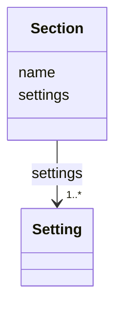

# Class: Section 


_Named sections within the configuration layout._


<!--
URI: [https://specification.margo.org/data-model/Section](https://specification.margo.org/data-model/Section)
-->





<!-- no inheritance hierarchy -->

## Attributes

| Name | Cardinality and Range | Description | Inheritance |
| ---  | --- | --- | --- |
| [name](name.md) | 1 <br/> [string](string.md) | The name of the section | direct |
| [settings](settings.md) | 1..* <br/> [Setting](Setting.md) | Settings are used to provide instructions to the workload orchestration softw... | direct |


## Usages

| used by | used in | type | used |
| ---  | --- | --- | --- |
| [Configuration](Configuration.md) | [sections](sections.md) | range | [Section](Section.md) |


<!--
## Identifier and Mapping Information


### Schema Source


* from schema: https://specification.margo.org/data-model


## Mappings

| Mapping Type | Mapped Value |
| ---  | ---  |
| self | https://specification.margo.org/data-model/Section |
| native | https://specification.margo.org/data-model/Section |


-->


??? note "Only relevant for contributors of the specification"

    ## LinkML Source

    <!-- TODO: investigate https://stackoverflow.com/questions/37606292/how-to-create-tabbed-code-blocks-in-mkdocs-or-sphinx -->

    ### Direct

    ??? note "Details"
        ```yaml
        name: Section
        description: Named sections within the configuration layout.
        from_schema: https://specification.margo.org/data-model
        attributes:
          name:
            name: name
            description: The name of the section. This may be used in the user interface to
              show the grouping of the associated parameters within the section.
            from_schema: https://specification.margo.org/application-schema
            domain_of:
            - Component
            - Parameter
            - DeploymentMetadata
            - ApplicationMetadata
            - Author
            - Organization
            - Section
            - Setting
            - Schema
            - ComponentStatus
            range: string
            required: true
          settings:
            name: settings
            description: Settings are used to provide instructions to the workload orchestration
              software vendor for displaying parameters to the user. A user MUST be able to
              provide values for all settings. See the [Setting](#setting-attributes) section
              below.
            from_schema: https://specification.margo.org/application-schema
            rank: 1000
            domain_of:
            - Section
            range: Setting
            required: true
            multivalued: true
            inlined: true
            inlined_as_list: true

        ```

    ### Induced

    ??? note "Details"
        ```yaml
        name: Section
        description: Named sections within the configuration layout.
        from_schema: https://specification.margo.org/data-model
        attributes:
          name:
            name: name
            description: The name of the section. This may be used in the user interface to
              show the grouping of the associated parameters within the section.
            from_schema: https://specification.margo.org/application-schema
            alias: name
            owner: Section
            domain_of:
            - Component
            - Parameter
            - DeploymentMetadata
            - ApplicationMetadata
            - Author
            - Organization
            - Section
            - Setting
            - Schema
            - ComponentStatus
            range: string
            required: true
          settings:
            name: settings
            description: Settings are used to provide instructions to the workload orchestration
              software vendor for displaying parameters to the user. A user MUST be able to
              provide values for all settings. See the [Setting](#setting-attributes) section
              below.
            from_schema: https://specification.margo.org/application-schema
            rank: 1000
            alias: settings
            owner: Section
            domain_of:
            - Section
            range: Setting
            required: true
            multivalued: true
            inlined: true
            inlined_as_list: true

        ```