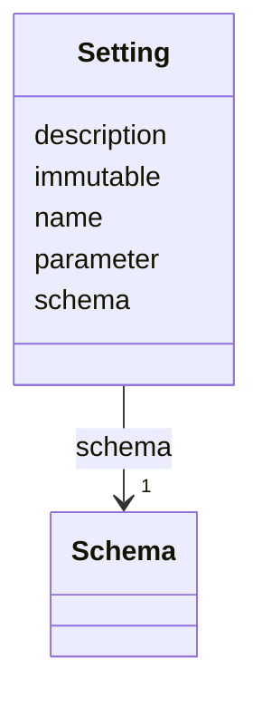

# Class: Setting 


_Individual configuration settings._


<!--
URI: [https://specification.margo.org/data-model/Setting](https://specification.margo.org/data-model/Setting)
-->





<!-- no inheritance hierarchy -->

## Attributes

| Name | Cardinality and Range | Description | Inheritance |
| ---  | --- | --- | --- |
| [parameter](parameter.md) | 1 <br/> [string](string.md) | The name of the [parameter](#parameter-attributes) the setting is associated ... | direct |
| [name](name.md) | 1 <br/> [string](string.md) | The parameter's display name to show in the user interface | direct |
| [description](description.md) | 0..1 <br/> [string](string.md) | The parameters's short description to provide additional context to the user ... | direct |
| [immutable](immutable.md) | 0..1 <br/> [boolean](boolean.md) | If true, indicates the parameter value MUST not be changed once it has been s... | direct |
| [schema](schema.md) | 1 <br/> [Schema](Schema.md) | The name of the schema definition to use to validate the parameter's value | direct |


## Usages

| used by | used in | type | used |
| ---  | --- | --- | --- |
| [Section](Section.md) | [settings](settings.md) | range | [Setting](Setting.md) |


<!--
## Identifier and Mapping Information


### Schema Source


* from schema: https://specification.margo.org/data-model


## Mappings

| Mapping Type | Mapped Value |
| ---  | ---  |
| self | https://specification.margo.org/data-model/Setting |
| native | https://specification.margo.org/data-model/Setting |


-->


??? note "Only relevant for contributors of the specification"

    ## LinkML Source

    <!-- TODO: investigate https://stackoverflow.com/questions/37606292/how-to-create-tabbed-code-blocks-in-mkdocs-or-sphinx -->

    ### Direct

    ??? note "Details"
        ```yaml
        name: Setting
        description: Individual configuration settings.
        from_schema: https://specification.margo.org/data-model
        attributes:
          parameter:
            name: parameter
            description: The name of the [parameter](#parameter-attributes) the setting is
              associated with.
            from_schema: https://specification.margo.org/application-schema
            rank: 1000
            domain_of:
            - Setting
            range: string
            required: true
          name:
            name: name
            description: The parameter's display name to show in the user interface.
            from_schema: https://specification.margo.org/application-schema
            domain_of:
            - Component
            - Parameter
            - DeploymentMetadata
            - ApplicationMetadata
            - Author
            - Organization
            - Section
            - Setting
            - Schema
            - ComponentStatus
            range: string
            required: true
          description:
            name: description
            description: The parameters's short description to provide additional context
              to the user in the user interface about what the parameter is for.
            from_schema: https://specification.margo.org/application-schema
            domain_of:
            - ApplicationMetadata
            - DeploymentProfileDescription
            - Setting
            range: string
          immutable:
            name: immutable
            description: If true, indicates the parameter value MUST not be changed once it
              has been set and used to install the application. Default is false if not provided.
            from_schema: https://specification.margo.org/application-schema
            rank: 1000
            domain_of:
            - Setting
            range: boolean
          schema:
            name: schema
            description: The name of the schema definition to use to validate the parameter's
              value. See the [Schema](#schema-attributes) section below.
            from_schema: https://specification.margo.org/application-schema
            domain_of:
            - Configuration
            - Setting
            range: Schema
            required: true
            inlined: false

        ```

    ### Induced

    ??? note "Details"
        ```yaml
        name: Setting
        description: Individual configuration settings.
        from_schema: https://specification.margo.org/data-model
        attributes:
          parameter:
            name: parameter
            description: The name of the [parameter](#parameter-attributes) the setting is
              associated with.
            from_schema: https://specification.margo.org/application-schema
            rank: 1000
            alias: parameter
            owner: Setting
            domain_of:
            - Setting
            range: string
            required: true
          name:
            name: name
            description: The parameter's display name to show in the user interface.
            from_schema: https://specification.margo.org/application-schema
            alias: name
            owner: Setting
            domain_of:
            - Component
            - Parameter
            - DeploymentMetadata
            - ApplicationMetadata
            - Author
            - Organization
            - Section
            - Setting
            - Schema
            - ComponentStatus
            range: string
            required: true
          description:
            name: description
            description: The parameters's short description to provide additional context
              to the user in the user interface about what the parameter is for.
            from_schema: https://specification.margo.org/application-schema
            alias: description
            owner: Setting
            domain_of:
            - ApplicationMetadata
            - DeploymentProfileDescription
            - Setting
            range: string
          immutable:
            name: immutable
            description: If true, indicates the parameter value MUST not be changed once it
              has been set and used to install the application. Default is false if not provided.
            from_schema: https://specification.margo.org/application-schema
            rank: 1000
            alias: immutable
            owner: Setting
            domain_of:
            - Setting
            range: boolean
          schema:
            name: schema
            description: The name of the schema definition to use to validate the parameter's
              value. See the [Schema](#schema-attributes) section below.
            from_schema: https://specification.margo.org/application-schema
            alias: schema
            owner: Setting
            domain_of:
            - Configuration
            - Setting
            range: Schema
            required: true
            inlined: false

        ```