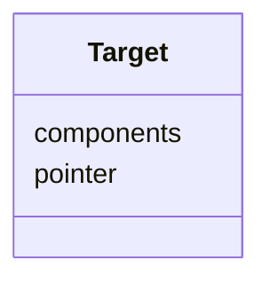

# Class: Target 


_Specifies where the parameter applies in the deployment._


<!--
URI: [https://specification.margo.org/data-model/Target](https://specification.margo.org/data-model/Target)
-->





<!-- no inheritance hierarchy -->

## Attributes

| Name | Cardinality and Range | Description | Inheritance |
| ---  | --- | --- | --- |
| [pointer](pointer.md) | 1 <br/> [string](string.md) | The name of the parameter in the deployment configuration | direct |
| [components](components.md) | 1..* <br/> [string](string.md) | Indicates which deployment profile [component](#component-attributes the para... | direct |


## Usages

| used by | used in | type | used |
| ---  | --- | --- | --- |
| [Parameter](Parameter.md) | [targets](targets.md) | range | [Target](Target.md) |


<!--
## Identifier and Mapping Information


### Schema Source


* from schema: https://specification.margo.org/data-model


## Mappings

| Mapping Type | Mapped Value |
| ---  | ---  |
| self | https://specification.margo.org/data-model/Target |
| native | https://specification.margo.org/data-model/Target |


-->


??? note "Only relevant for contributors of the specification"

    ## LinkML Source

    <!-- TODO: investigate https://stackoverflow.com/questions/37606292/how-to-create-tabbed-code-blocks-in-mkdocs-or-sphinx -->

    ### Direct

    ??? note "Details"
        ```yaml
        name: Target
        description: Specifies where the parameter applies in the deployment.
        from_schema: https://specification.margo.org/data-model
        attributes:
          pointer:
            name: pointer
            description: The name of the parameter in the deployment configuration.  For Helm
              deployments, this is the dot notation for the matching element in the `values.yaml`
              file. This follows the same naming convention you would use with the `--set`
              command line argument with the `helm install` command.  For compose deployments,
              this is the name of the environment variable to set.
            from_schema: https://specification.margo.org/deployments
            rank: 1000
            domain_of:
            - Target
            range: string
            required: true
          components:
            name: components
            description: Indicates which deployment profile [component](#component-attributes
              the parameter target applies to.  The component name specified here MUST match
              a component name in the [deployment profiles](#deploymentprofile-attributes)
              section.
            from_schema: https://specification.margo.org/deployments
            domain_of:
            - DeploymentProfile
            - Target
            - DeploymentStatusManifest
            range: string
            required: true
            multivalued: true

        ```

    ### Induced

    ??? note "Details"
        ```yaml
        name: Target
        description: Specifies where the parameter applies in the deployment.
        from_schema: https://specification.margo.org/data-model
        attributes:
          pointer:
            name: pointer
            description: The name of the parameter in the deployment configuration.  For Helm
              deployments, this is the dot notation for the matching element in the `values.yaml`
              file. This follows the same naming convention you would use with the `--set`
              command line argument with the `helm install` command.  For compose deployments,
              this is the name of the environment variable to set.
            from_schema: https://specification.margo.org/deployments
            rank: 1000
            alias: pointer
            owner: Target
            domain_of:
            - Target
            range: string
            required: true
          components:
            name: components
            description: Indicates which deployment profile [component](#component-attributes
              the parameter target applies to.  The component name specified here MUST match
              a component name in the [deployment profiles](#deploymentprofile-attributes)
              section.
            from_schema: https://specification.margo.org/deployments
            alias: components
            owner: Target
            domain_of:
            - DeploymentProfile
            - Target
            - DeploymentStatusManifest
            range: string
            required: true
            multivalued: true

        ```