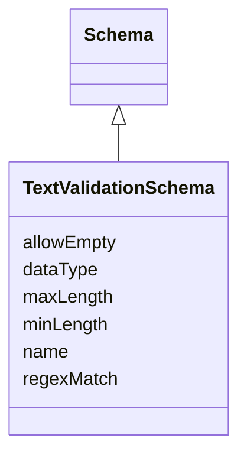

# Class: TextValidationSchema 


_Extends schema to define a string/text-specific set of validation rules that can be used._


<!--
URI: [https://specification.margo.org/data-model/TextValidationSchema](https://specification.margo.org/data-model/TextValidationSchema)
-->





## Inheritance
* [Schema](Schema.md)
    * **TextValidationSchema**


## Attributes

| Name | Cardinality and Range | Description | Inheritance |
| ---  | --- | --- | --- |
| [allowEmpty](allowEmpty.md) | 0..1 <br/> [boolean](boolean.md) | If true, indicates a value must be provided | direct |
| [minLength](minLength.md) | 0..1 <br/> [integer](integer.md) | If set, indicates the minimum number of characters the value must have to be ... | direct |
| [maxLength](maxLength.md) | 0..1 <br/> [integer](integer.md) | If set, indicates the maximum number of characters the value must have to be ... | direct |
| [regexMatch](regexMatch.md) | 0..1 <br/> [string](string.md) | If set, indicates a regular expression to use to validate the value | direct |
| [name](name.md) | 1 <br/> [string](string.md) | The name of the schema rule | [Schema](Schema.md) |
| [dataType](dataType.md) | 1 <br/> [string](string.md) | Indicates the expected data type for the user provided value | [Schema](Schema.md) |


<!--
## Identifier and Mapping Information


### Schema Source


* from schema: https://specification.margo.org/data-model


## Mappings

| Mapping Type | Mapped Value |
| ---  | ---  |
| self | https://specification.margo.org/data-model/TextValidationSchema |
| native | https://specification.margo.org/data-model/TextValidationSchema |


-->


??? note "Only relevant for contributors of the specification"

    ## LinkML Source

    <!-- TODO: investigate https://stackoverflow.com/questions/37606292/how-to-create-tabbed-code-blocks-in-mkdocs-or-sphinx -->

    ### Direct

    ??? note "Details"
        ```yaml
        name: TextValidationSchema
        description: Extends schema to define a string/text-specific set of validation rules
          that can be used.
        from_schema: https://specification.margo.org/data-model
        is_a: Schema
        attributes:
          allowEmpty:
            name: allowEmpty
            description: If true, indicates a value must be provided. Default is false if
              not provided.
            from_schema: https://specification.margo.org/application-schema
            rank: 1000
            domain_of:
            - TextValidationSchema
            - BooleanValidationSchema
            - NumericIntegerValidationSchema
            - NumericDoubleValidationSchema
            - SelectValidationSchema
            range: boolean
            required: false
          minLength:
            name: minLength
            description: If set, indicates the minimum number of characters the value must
              have to be considered valid.
            from_schema: https://specification.margo.org/application-schema
            rank: 1000
            domain_of:
            - TextValidationSchema
            range: integer
            required: false
          maxLength:
            name: maxLength
            description: If set, indicates the maximum number of characters the value must
              have to be considered valid.
            from_schema: https://specification.margo.org/application-schema
            rank: 1000
            domain_of:
            - TextValidationSchema
            range: integer
            required: false
          regexMatch:
            name: regexMatch
            description: If set, indicates a regular expression to use to validate the value.
            from_schema: https://specification.margo.org/application-schema
            rank: 1000
            domain_of:
            - TextValidationSchema
            range: string
            required: false

        ```

    ### Induced

    ??? note "Details"
        ```yaml
        name: TextValidationSchema
        description: Extends schema to define a string/text-specific set of validation rules
          that can be used.
        from_schema: https://specification.margo.org/data-model
        is_a: Schema
        attributes:
          allowEmpty:
            name: allowEmpty
            description: If true, indicates a value must be provided. Default is false if
              not provided.
            from_schema: https://specification.margo.org/application-schema
            rank: 1000
            alias: allowEmpty
            owner: TextValidationSchema
            domain_of:
            - TextValidationSchema
            - BooleanValidationSchema
            - NumericIntegerValidationSchema
            - NumericDoubleValidationSchema
            - SelectValidationSchema
            range: boolean
            required: false
          minLength:
            name: minLength
            description: If set, indicates the minimum number of characters the value must
              have to be considered valid.
            from_schema: https://specification.margo.org/application-schema
            rank: 1000
            alias: minLength
            owner: TextValidationSchema
            domain_of:
            - TextValidationSchema
            range: integer
            required: false
          maxLength:
            name: maxLength
            description: If set, indicates the maximum number of characters the value must
              have to be considered valid.
            from_schema: https://specification.margo.org/application-schema
            rank: 1000
            alias: maxLength
            owner: TextValidationSchema
            domain_of:
            - TextValidationSchema
            range: integer
            required: false
          regexMatch:
            name: regexMatch
            description: If set, indicates a regular expression to use to validate the value.
            from_schema: https://specification.margo.org/application-schema
            rank: 1000
            alias: regexMatch
            owner: TextValidationSchema
            domain_of:
            - TextValidationSchema
            range: string
            required: false
          name:
            name: name
            description: The name of the schema rule. This used in the [setting](#setting-attributes)
              to link the setting to the schema rule.
            from_schema: https://specification.margo.org/application-schema
            identifier: true
            alias: name
            owner: TextValidationSchema
            domain_of:
            - Component
            - Parameter
            - DeploymentMetadata
            - ApplicationMetadata
            - Author
            - Organization
            - Section
            - Setting
            - Schema
            - ComponentStatus
            range: string
            required: true
          dataType:
            name: dataType
            description: Indicates the expected data type for the user provided value. Accepted
              values are string, integer, double, boolean, array[string], array[integer],
              array[double], array[boolean]. At a minimum, the provided parameter value MUST
              match the schema's data type if no other validation rules are provided.
            from_schema: https://specification.margo.org/application-schema
            rank: 1000
            alias: dataType
            owner: TextValidationSchema
            domain_of:
            - Schema
            range: string
            required: true

        ```