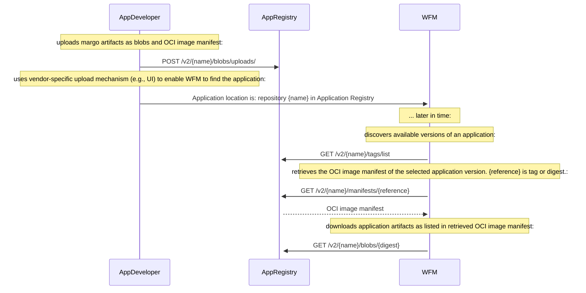

# Application Registry

The interactions of an `Application Registry` are described [here](../../concepts/workloads/application-registry.md) from a conceptual view. This section formally specifies the API of the `Application Registry` and the exchange of an [Application Package](./application-package-definition.md), defined through an [Application Description](../../specification/application-package/) file, from an Application Developer to the Workload Fleet Manager (WFM). The `Application Registry` is designed as an `OCI Registry`, i.e., it offers an API compliant with the [OCI Registry API (v1.1.0)](https://github.com/opencontainers/distribution-spec/blob/v1.1.0/spec.md) for digital artifact distribution. This way, the Application Registry hosts the parts of an [Application Package](https://specification.margo.org/app-interoperability/application-package-definition/) in form of `blobs` and uses `image manifests` according to [OCI Image specification](https://github.com/opencontainers/image-spec/blob/v1.0.1/manifest.md)) to list a set of `layers`, each pointing at a blob.

## Overview of API Endpoints

The WFM interacts with the Application Registry using standard OCI Registry API endpoints:

* Tags: `/v2/{name}/tags/list` for listing available versions of an Application Package
* Manifest: `/v2/{name}/manifests/{reference}` for retrieving an image manifest (identifed through the `{reference}`) that lists layers, which represent the parts of the Application Package.
* Blob: `/v2/{name}/blobs/{digest}` for downloading parts of the Application Package

`{name}` is the namespace of the repository, which needs to be directly communicted by the App Developer to the WFM vendor. It could be for example a combination of the organization's and application's name.

Further details on how to use these API endpoints are specified below [towards App Developer](#margo-application-registry-api-endpoint-definitions-towards-app-developer-aligned-with-oci_spec) and [towards WFM](#margo-application-registry-api-endpoint-definitions-towards-wfm-aligned-with-oci_spec).

## Authentication & Authorization & Security
Margo recommends the use of an Authentication Service within the interaction of WFM and Application Registry as conceptually described [here](../../concepts/workloads/application-registry.md), e.g., implemented using OAuth 2.0. This involves the following workflow:

* WFM obtains credentials during onboarding
* WFM requests a token from an Authentication Service
* WFM uses the token for subsequent API calls to the Application Registry
* Application Registry validates the token and enforces access control

Thereby, all communications must use TLS 1.3+ to ensure transport security.

> Note: Authentication & Authorization & Security mechanisms should be defined centrally and homogeneously across margo. Hence, it is not further defined here.

Further, tools such as [cosign](https://github.com/sigstore/cosign) may be employed for signing artifacts uploaded to the Application Registry and storing the signatures alongside the artifacts they verify.

## Reference Implementation
A reference implementation can be found [here](https://github.com/margo/app-package-definition-wg/blob/main/application-registry-example/app_registry_as_oci_registry.md). It utilizes:

* Application Registry: Docker Registry (open source OCI Registry)
* Client Library: ORAS (OCI Registry as Storage) tool
* Examples: Sample applications and configuration for demonstration

## Overview of Interactions




## margo 'Application Registry' API Endpoint Definitions towards App Developer (aligned with OCI_spec)

### Upload a margo Application Package

The Application Developer uploads the margo-compliant `Application Package` to the Application Registry. I.e., the parts of the Application Package are uploaded as blobs and an OCI image manifest is created via the [end-4a / end-4b](https://github.com/opencontainers/distribution-spec/blob/v1.1.0/spec.md#endpoints) endpoints.

Thereby, the Application Developer needs to make sure the OCI image manifest will be adhering to the margo-specific constraints detailed [here](#manifest-as-response-from-application-registry).
Other than these constraints on the OCI image manifest format, there are no further margo-specific constraints regarding the upload of the Application Package and the OCI_spec applies to this interface of the Application Registry. 

This process of uploading a margo Application Package is described in the [reference implementation](https://github.com/margo/app-package-definition-wg/blob/main/application-registry-example/app_registry_as_oci_registry.md).


## margo 'Application Registry' API Endpoint Definitions towards WFM (aligned with OCI_spec)

### List margo Application Package Versions

This must be implemented according to OCI_spec endpoint [end-8a / end-8b](https://github.com/opencontainers/distribution-spec/blob/v1.1.0/spec.md#endpoints).
Use `tags` to discover available versions of a Margo application.
`{name}` is the namespace of the repository, which needs to be directly communicted by the App Developer to the WFM vendor.

`GET /v2/{name}/tags/list`

#### Headers:

```Authorization: Bearer <token>```
> However, security mechanism needs to be margo-centrally defined.

#### Query Parameters:

* n=<integer> (optional, limits results)
* last=<string> (optional, pagination cursor)

####  Success Response:

200 OK with list of tags

#### Example Response:

```json
{
  "name": "organization/app1",
  "tags": [
    "v1.0.0",
    "v1.1.0",
    "latest"
  ]
}
```

####Pull Application's OCI Image Manifest
This must be implemented according to OCI_spec endpoint [end-3](https://github.com/opencontainers/distribution-spec/blob/v1.1.0/spec.md#endpoints).
Pulls an OCI image manifest of a specified version, which belongs to a margo Application Package.
The `{reference}` is the `tag` of an OCI image manifest. The `tag` has been discovered via the [listing of app versions](#list-margo-application-versions).
`{name}` is the namespace of the repository.

``` GET /v2/{name}/manifests/{reference} ```

#### Headers:

`Authorization: Bearer <token>`
> However, security mechanism needs to be margo-centrally defined.

`Accept: application/vnd.oci.image.manifest.v1+json`

#### Success Response:

200 OK with OCI image manifest content

#### Fail Response:

404 Not Found if OCI image manifest doesn't exist

#### OCI Image Manifest as Response from Application Registry:

In the margo context, OCI image manifests contain pointers to all parts of an Application Package within an Application Registry. 

Each ``version`` of an Application Pacakage has its own OCI image manifest.

The ``schemaVersion`` of the OCI image manifest needs to be ``2``.

The ``artifactType`` of the OCI image manifest must be ``application/vnd.margo.app.v1+json``.

The ``config`` object must be declared as empty by defining its ``mediaType`` as ``application/vnd.oci.empty.v1+json``. 

Each element of the ``layers`` array contains a reference (so called `digests`) to an artifact (so called `blobs`) that is part of the Application Package.
Each artifact of an Application Package must be listed as an element of the ``layers`` array.

The [Application Description](https://specification.margo.org/margo-api-reference/workload-api/application-package-api/application-description/) of the Application Package must be referred to in one element of the ``layers`` array. The ``mediaType`` of this layer/blob must be ``application/vnd.margo.app.description.v1+yaml``.

Each [application resource](https://specification.margo.org/app-interoperability/application-package-definition/), which is an additional file associated with the application (e.g., manual, icon, release notes, license file, etc.), must be referred to in an element of the ``layers`` array and an ``annotation`` must be added to this element, which has the annotation key ``org.margo.app.resource``, and the annotation value must reflect the dotted path to the this resource in the Application Description. 
E.g., an application icon stored as the file ``resources/margo.jpg`` will be referenced in the Application Description   under ``metadata.catalog.application.icon: resources/margo.jpg`` and in the OCI image manifest, the respective layer of the icon resource has the annotation ``org.margo.app.resource`` with the value ``metadata.catalog.application.icon`` (see also OCI image manifest example below).


The following response example is a margo-specific OCI image manifest following the [OCI Image Manifest Specification](https://github.com/opencontainers/image-spec/blob/v1.0.1/manifest.md) and the above defined specifics:

```json
{
  "schemaVersion": 2,
  "mediaType": "application/vnd.oci.image.manifest.v1+json",
  "artifactType": "application/vnd.margo.app.v1+json" # this MUST be the artifactType of en OCI image manifest of a margo Application Package,
  "config": {
    "mediaType": "application/vnd.oci.empty.v1+json", # the 'config' object MUST be empty
    "digest": "sha256:44136fa355b3678a1146ad16f7e8649e94fb4fc21fe77e8310c060f61caaff8a",
    "size": 2,
    "data": "e30="
  },
  "layers": [
    {
      "mediaType": "application/vnd.margo.app.description.v1+yaml", # this MUST be the artifactType of a margo Application Description file
      "digest": "sha256:f6b79149e6650b0064c146df7c045d157f3656b5ad1279b5ce9f4446b510bacf",
      "size": 999,
      "annotations": {
        "org.opencontainers.image.title": "margo.yaml"
      }
    },
    {
      "mediaType": "text/markdown",
      "digest": "sha256:e373b123782a2b52483a9124cc9c578e0ed0300cb4131b73b0c79612122b8361",
      "size": 1596,
      "annotations": {
        "org.margo.app.resource": "metadata.catalog.application.descriptionFile", # each margo application resource MUST be annotated with a dotted path to its definition in the Application Description file
        "org.opencontainers.image.title": "resources/description.md"
      }
    },
    {
      "mediaType": "text/markdown",
      "digest": "sha256:af7db4ab9030533b6cda2325247920c3659bc67a7d49f3d5098ae54a64633ec7",
      "size": 25,
      "annotations": {
        "org.margo.app.resource": "metadata.catalog.application.licenseFile", # each margo application resource MUST be annotated with a dotted path to its definition in the Application Description file
        "org.opencontainers.image.title": "resources/license.md"
      }
    },
    {
      "mediaType": "image/jpeg",
      "digest": "sha256:451410b6adfdce1c974da2275290d9e207911a4023fafea0e283fad0502e5e56",
      "size": 5065,
      "annotations": {
        "org.margo.app.resource": "metadata.catalog.application.icon", # each margo application resource MUST be annotated with a dotted path to its definition in the Application Description file
        "org.opencontainers.image.title": "resources/margo.jpg"
      }
    },
    {
      "mediaType": "text/markdown",
      "digest": "sha256:c412d143084c3b051d7ea4b166a7bfffb4550f401d89cae8898991c65e90f736",
      "size": 42,
      "annotations": {
        "org.margo.app.resource": "metadata.catalog.application.releaseNotes", # each margo application resource MUST be annotated with a dotted path to its definition in the Application Description file
        "org.opencontainers.image.title": "resources/release-notes.md"
      }
    }
  ],
}
```

#### Margo-Specific Media Types

|Media Type|Description|
|----------|----------|
|``application/vnd.margo.app.v1+json`` | MUST be used as the **artifactType** to mark the OCI image manifest as the definition of a margo Application Package |
|``application/vnd.margo.app.description.v1+yaml``	| MUST be used to mark a layer in the OCI image manifest as pointing to the margo Application Description file |


#### Margo-Specific Annotation Keys

|Annotation Key | Description|
|----------|----------|
|``org.margo.app.resource``	| This MUST be used to annotate a layer/blob that references a margo application resource |


### Get margo Application Description or Resource
This must be implemented according to OCI_spec endpoint [end-2](https://github.com/opencontainers/distribution-spec/blob/v1.1.0/spec.md#endpoints).
Retrieves a margo Application Description or Appliction Resource by pulling a blob. 
`{digest}` is the blobs digest as listed in the application's OCI image manifest that has been [retrieved earlier](#pull-margo-application-manifest).
`{name}` is the namespace of the repository.


`GET /v2/{name}/blobs/{digest}`

#### Headers:

`Authorization: Bearer <token>`
> However, security mechanism needs to be margo-centrally defined.

#### Success Response:

`200 OK with blob content`

#### Fail Response:

`404 Not Found if blob doesn't exist`
