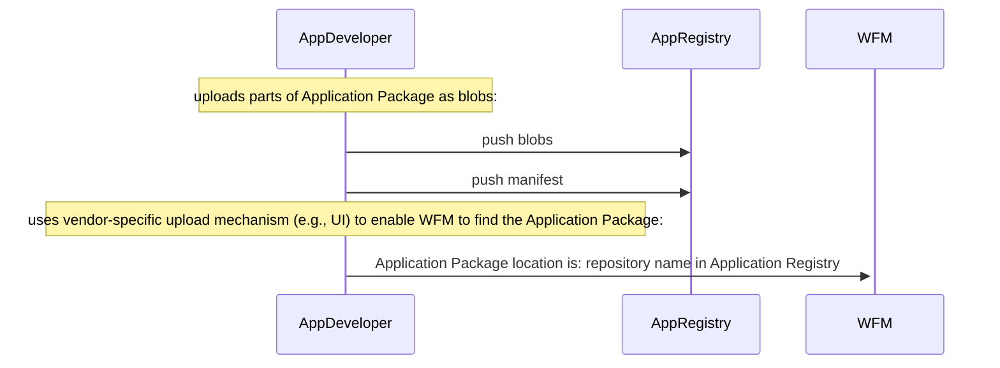
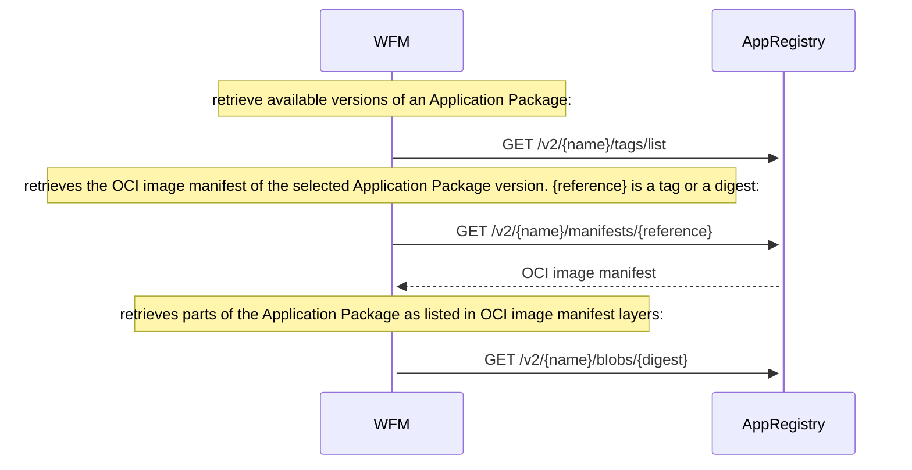

# Application Registry

The interactions of an `Application Registry` are described [here](../../concepts/applications/application-registry.md) from a conceptual view. This section formally specifies the API of the `Application Registry` and the exchange of an [Application Package](../../concepts/applications/application-package.md), defined through an [Application Description](../../specification/applications/application-description.md) file, from an Application Developer to the [Workload Fleet Manager](../../personas-and-definitions/technical-lexicon.md#workload-fleet-manager) (WFM). The `Application Registry` is designed as an `OCI Registry`, i.e., it offers an API compliant with the [OCI Registry API (v1.1.0)](https://github.com/opencontainers/distribution-spec/blob/v1.1.0/spec.md) (called here the "OCI_spec") for digital artifact distribution. This way, the Application Registry hosts the parts of an [Application Package](../../concepts/applications/application-package.md) in the form of `blobs` and uses `image manifests` according to [OCI Image specification](https://github.com/opencontainers/image-spec/blob/v1.0.1/manifest.md) to list a set of `layers`, each pointing at a blob.

## Overview of API Endpoints

The WFM MUST interact with the Application Registry compliant to the OCI Registry API endpoints defined in the [OCI_spec](https://github.com/opencontainers/distribution-spec/blob/v1.1.0/spec.md):

* Tags: `/v2/{name}/tags/list` for listing available versions of an Application Package
* Manifest: `/v2/{name}/manifests/{reference}` for retrieving an image manifest (identifed through the `{reference}`) that lists layers, which represent the parts of the Application Package.
* Blob: `/v2/{name}/blobs/{digest}` for downloading parts of the Application Package

`{name}` is the namespace of the repository, which needs to be directly communicted by the App Developer to the WFM vendor. It could be for example a combination of the organization's and application's name.

Further details on how to use these API endpoints are specified below [towards App Developer](#uploading-an-application-package) and [towards WFM](#retrieving-an-application-package).

## Authentication, Authorization & Security
Margo recommends the use of an Authentication Service for the interactions between the WFM and Application Registry as conceptually described [here](../../concepts/applications/application-registry.md), e.g., implemented using OAuth 2.0. This involves the following workflow:

* WFM obtains credentials during onboarding
* WFM requests a token from an Authentication Service
* WFM uses the token for subsequent API calls to the Application Registry
* Application Registry validates the token and enforces access control

Thereby, all communications must use TLS 1.3+ to ensure transport security.

> Note: Authentication, Authorization & Security mechanisms should be defined centrally and homogeneously across Margo. Hence, it is not further defined here.

Further, tools such as [cosign](https://github.com/sigstore/cosign) may be employed for signing artifacts uploaded to the Application Registry and storing the signatures alongside the artifacts they verify.


## Uploading an Application Package

As shown in the sequence diagram below, the Application Developer uploads the Margo-compliant `Application Package` to the Application Registry. I.e., all parts of the Application Package MUST be pushed as blobs compliant with the [end-4a / end-4b](https://github.com/opencontainers/distribution-spec/blob/v1.1.0/spec.md#endpoints) endpoints of the OCI_spec. 

Subsequently, the Application Developer creates an OCI image manifest that lists layers, each of which links to an uploaded blob. Then the manifest MUST be pushed to the Application Registry compliant to the [end-7](https://github.com/opencontainers/distribution-spec/blob/v1.1.0/spec.md#endpoints) endpoint of the OCI_spec.

The uploaded OCI image manifest MUST adhere to the Margo-specific constraints detailed [here](#oci-image-manifest-as-response-from-application-registry).

Subsequently, the App Developer uses a UI or other vendor-specific mechanism to communicate (either directly or indirectly, e.g., via a Marketplace) to the WFM the namespace of the Application Package's repository. 



There are no further Margo-specific constraints regarding the upload of the Application Package. The details defined in the [OCI_spec](https://github.com/opencontainers/distribution-spec/blob/v1.1.0/spec.md) MUST be applied to this interface of the Application Registry. 


## Retrieving an Application Package

The WFM has received the namespace of the repository of the Application Package at the Application Registry.

Next, as shown in the sequence diagram below, the WFM uses the API endpoints defined in the OCI_spec to retrieve a list of Application Package versions (as detailed [here](#list-margo-application-package-versions)).

Then, the WFM pulls the OCI image manifest of the selected version of the Application Package, with the identifying reference being a tag or digest (as detailed [here](#pull-oci-image-manifest-of-application-package)).

Finally, all parts (e.g., the Application Description file, the icon, the license, etc.) of the Application Package are retrieved by pulling the respective blobs listed as layers in the image manifest (as detailed [here](#get-parts-of-application-package)). 



### List Margo Application Package Versions

The interface to retrieve the list of versions of an Application Package MUST be implemented according to OCI_spec endpoint [end-8a](https://github.com/opencontainers/distribution-spec/blob/v1.1.0/spec.md#endpoints). 

To get a list of available versions of an Application Package, an HTTP ``GET`` request to a resource path MUST be performed in the following format: `/v2/{name}/tags/list`. The `{name}` variable is the namespace of the Application Package repository, which was communicated by the App Developer to the WFM vendor.

The HTTP headers of the ``GET`` request MAY include ```Authorization: Bearer <token>``` for including the interaction with the [Authentication Service](../../concepts/applications/application-registry.md).

To query a subset of tags, the following query parameters MUST be implemented by the Application Registry as defined by OCI_spec endpoint [end-8b](https://github.com/opencontainers/distribution-spec/blob/v1.1.0/spec.md#endpoints):

* ``n=<integer>`` (optional, limits results to n tags)
* ``last=<tagname>`` (optional, starts list of tags after ``<tagname>``)

The response of the HTTP ``GET`` request according to [end-8a/end-8b](https://github.com/opencontainers/distribution-spec/blob/v1.1.0/spec.md#endpoints) is a list of tags, which comply with the versions of available Application Packages. According to OCI_spec, upon success, the response MUST be a JSON body in the following format:

```json
{
  "name": "<name>",
  "tags": [
    "<tag1>", # each tag MUST be the value of the 'metadata.version' of the associated Application Package's Application Description document.
    "<tag2>",
    "<tag3>"
  ]
}
```

Thereby, a listed tag of an image manifest MUST be the same as the value of the key ``metadata.version`` as specified in the Application Description document of the associated Application Package.

#### Example A:

Request: GET ``http://famous-app-registry/v2/northstar-industrial-applications/app1/tags/list``

Response: 
```json
{
  "name": "northstar-industrial-applications/app1",
  "tags": [
    "v1.0.0",
    "v1.1.0",
    "latest"
  ]
}
```

#### Example B:

Request: GET ``http://famous-app-registry/v2/northstar-industrial-applications/app1/tags/list?n=2&last=v1.0.0``

Response: 
```json
{
  "name": "northstar-industrial-applications/app1",
  "tags": [
    "v1.1.0",
    "latest"
  ]
}
```

### Pull OCI Image Manifest of Application Package

The interface to retrieve the OCI image manifest of a specified version, which belongs to an Application Package, MUST be implemented according to OCI_spec endpoint [end-3](https://github.com/opencontainers/distribution-spec/blob/v1.1.0/spec.md#endpoints).

To pull an Application Package, an HTTP ``GET`` request to a resource path MUST be performed in the following format: 
`/v2/{name}/manifests/{reference}`. 
The `{reference}` is the `tag` of an OCI image manifest. The `tag` has been discovered via the [listing of application package versions](#list-margo-application-package-versions).
The `{name}` variable is the namespace of the Application Package repository.

The HTTP headers of the ``GET`` request MAY include ```Authorization: Bearer <token>``` for including the interaction with the [Authentication Service](../../concepts/applications/application-registry.md).

#### OCI Image Manifest as Response from Application Registry:

The successful response of the HTTP ``GET`` request is an OCI image manifest (as defined in the OCI_spec), which MUST contain pointers to all parts of an Application Package within the Application Registry.

Each version of an Application Package MUST have its own OCI image manifest.

The ``schemaVersion`` of the OCI image manifest needs to be ``2``.

The ``artifactType`` of the OCI image manifest must be ``application/vnd.margo.app.v1+json``.

The ``config`` object must be declared as empty by defining its ``mediaType`` as ``application/vnd.oci.empty.v1+json``. 

Each element of the ``layers`` array contains a reference (so-called `digests`) to an artifact (so-called `blobs`) that is a part of the Application Package.

Each Application Package part must be listed as an element of the ``layers`` array:

* The [Application Description](../../specification/applications/application-description.md) of the Application Package must be referred to in one element of the ``layers`` array, where the ``mediaType`` of this layer/blob must be ``application/vnd.margo.app.description.v1+yaml``.
* Each [application resource](../../concepts/applications/application-package.md), which is an additional file associated with the application (e.g., manual, icon, release notes, license file, etc.), must be referred to in an element of the ``layers`` array. Such a layer must have an ``annotation``, which has the annotation key ``org.margo.app.resource``, and the annotation value must reflect the dotted path to the this resource in the [Application Description file](../../specification/applications/application-description.md). E.g., an application icon stored as the file ``resources/margo.jpg`` is referenced in the Application Description under ``metadata.catalog.application.icon: resources/margo.jpg`` and in the OCI image manifest, the respective layer of the icon resource has the annotation ``org.margo.app.resource`` with the value ``metadata.catalog.application.icon`` (see also OCI image manifest example below).

The following response example is a Margo-specific OCI image manifest following the [OCI Image Manifest Specification](https://github.com/opencontainers/image-spec/blob/v1.0.1/manifest.md) and the above defined specifics:

```json
{
  "schemaVersion": 2,
  "mediaType": "application/vnd.oci.image.manifest.v1+json",
  "artifactType": "application/vnd.margo.app.v1+json" # this MUST be the artifactType of an OCI image manifest of a Margo Application Package,
  "config": {
    "mediaType": "application/vnd.oci.empty.v1+json", # the 'config' object MUST be empty
    "digest": "sha256:44136fa355b3678a1146ad16f7e8649e94fb4fc21fe77e8310c060f61caaff8a",
    "size": 2,
    "data": "e30="
  },
  "layers": [
    {
      "mediaType": "application/vnd.margo.app.description.v1+yaml", # this MUST be the artifactType of a Margo Application Description file
      "digest": "sha256:f6b79149e6650b0064c146df7c045d157f3656b5ad1279b5ce9f4446b510bacf",
      "size": 999,
      "annotations": {
        "org.opencontainers.image.title": "margo.yaml"
      }
    },
    {
      "mediaType": "text/markdown",
      "digest": "sha256:e373b123782a2b52483a9124cc9c578e0ed0300cb4131b73b0c79612122b8361",
      "size": 1596,
      "annotations": {
        "org.margo.app.resource": "metadata.catalog.application.descriptionFile", # each Margo application resource MUST be annotated with a dotted path to its definition in the Application Description file
        "org.opencontainers.image.title": "resources/description.md"
      }
    },
    {
      "mediaType": "text/markdown",
      "digest": "sha256:af7db4ab9030533b6cda2325247920c3659bc67a7d49f3d5098ae54a64633ec7",
      "size": 25,
      "annotations": {
        "org.margo.app.resource": "metadata.catalog.application.licenseFile", # each Margo application resource MUST be annotated with a dotted path to its definition in the Application Description file
        "org.opencontainers.image.title": "resources/license.md"
      }
    },
    {
      "mediaType": "image/jpeg",
      "digest": "sha256:451410b6adfdce1c974da2275290d9e207911a4023fafea0e283fad0502e5e56",
      "size": 5065,
      "annotations": {
        "org.margo.app.resource": "metadata.catalog.application.icon", # each Margo application resource MUST be annotated with a dotted path to its definition in the Application Description file
        "org.opencontainers.image.title": "resources/margo.jpg"
      }
    },
    {
      "mediaType": "text/markdown",
      "digest": "sha256:c412d143084c3b051d7ea4b166a7bfffb4550f401d89cae8898991c65e90f736",
      "size": 42,
      "annotations": {
        "org.margo.app.resource": "metadata.catalog.application.releaseNotes", # each Margo application resource MUST be annotated with a dotted path to its definition in the Application Description file
        "org.opencontainers.image.title": "resources/release-notes.md"
      }
    }
  ],
}
```

#### Margo-Specific Media Types

|Media Type|Description|
|----------|----------|
|``application/vnd.margo.app.v1+json`` | MUST be used as the **artifactType** to mark the OCI image manifest as the definition of a Margo Application Package |
|``application/vnd.margo.app.description.v1+yaml``	| MUST be used to mark a layer in the OCI image manifest as pointing to the Margo Application Description file |


#### Margo-Specific Annotation Keys

|Annotation Key | Description|
|----------|----------|
|``org.margo.app.resource``	| MUST be used to annotate a layer/blob that references a Margo application resource |


### Get Parts of Application Package

The interface to retrieve Application Package parts, i.e., Application Description or Application Resource (e.g., icon, license, etc.), MUST be implemented according to OCI_spec endpoint [end-2](https://github.com/opencontainers/distribution-spec/blob/v1.1.0/spec.md#endpoints) by pulling a blob.

To pull such a blob, an HTTP ``GET`` request to a resource path MUST be performed in the following format: 
`/v2/{name}/blobs/{digest}`. 
The `{digest}` is the blob's digest as listed in the application's OCI image manifest that has been [retrieved earlier](#pull-oci-image-manifest-of-application-package).
The `{name}` variable is the namespace of the Application Package repository.

The HTTP headers of the ``GET`` request MAY include ```Authorization: Bearer <token>``` for including the interaction with the [Authentication Service](../../concepts/applications/application-registry.md).
